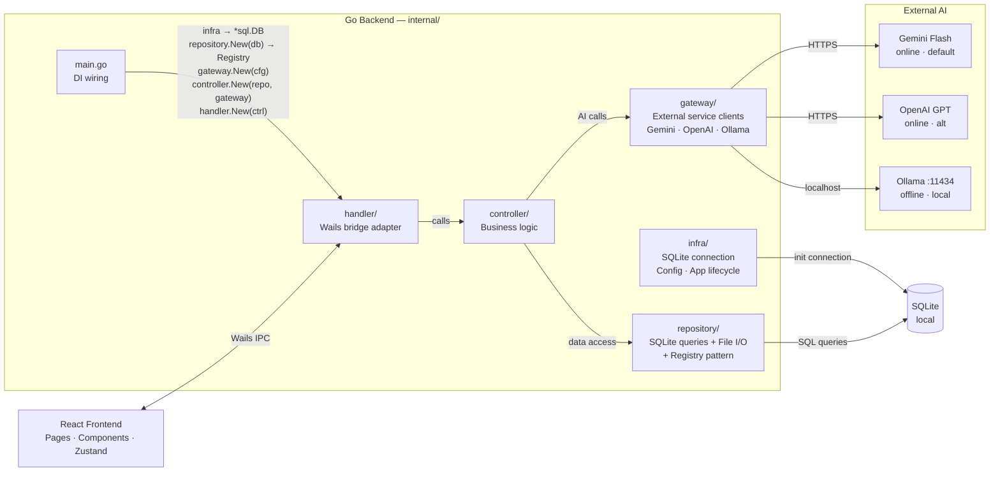

# TranslateApp — Tài liệu Kiến trúc Hệ thống (v1.8)

> **Phiên bản:** 1.8
> **Ngày:** 2026-03-20
> **Trạng thái:** Draft — Internal Review
> **Team:** 2–3 người
>
> **Changelog v1.8:**
> - ✅ **[Added]** Section 5.9 Settings UX — popover + ModelAIModal + Giao diện submenu (từ mockup)
> - ✅ **[Added]** Section 5.10 Sidebar Session Grouping — Ghim / Hôm nay / 1 ngày trước / 2 ngày trước / Cũ hơn
> - ✅ **[Added]** Section 5.11 Session Title Rename UX — sidebar (Enter/Esc only) vs header (blur auto-save)
> - ✅ **[Decision]** `DeleteSession` → **V2**, bỏ khỏi V1 IPC + dropdown menu; dropdown chỉ còn 2 actions
> - ✅ **[Decision]** `activeProvider` V1 chỉ 2 values: `'gemini'` (Online) / `'ollama'` (Offline) — 'openai' reserved V2
> - ✅ **[Fixed]** File page limit `{N}` → 100 trang
> - ✅ **[Fixed]** Session grouping: xác nhận labels (Hôm nay / 1 ngày trước / 2 ngày trước / Cũ hơn)
> - ✅ **[Decision]** Không có `fileStore` Zustand — file translation state là **local useState** trong `useFileTranslation` hook
> - ✅ **[Decision]** RetranslatePopover: **không có targetLang dropdown** — retranslate giữ nguyên ngôn ngữ đích của message gốc, chỉ đổi Style và Model
>
> **Changelog v1.7:**
> - ✅ **[Fixed]** Section 10.1: rewrite toàn bộ — bỏ chat references, dùng `CreateSessionAndSend` atomic
> - ✅ **[Added]** `CreateSessionAndSend(req CreateSessionAndSendRequest)` vào Section 7.1 IPC table
> - ✅ **[Renamed]** `CreateSessionRequest` → `CreateSessionAndSendRequest` (merged với `SendRequest` fields)
> - ✅ **[Updated]** Section 5.4 note: `CreateSessionAndSend` là atomic, không 2 calls riêng
> - ✅ **[Confirmed]** `FileInfo.type`: giữ `'pdf' | 'docx'` — V1 không hỗ trợ `.txt`; DB schema `CHECK` cũng chỉ còn `('pdf','docx')`
> - ✅ **[Added]** Section 10.0 App Startup Flow — `StartPage` (greeting + input, `activeSessionId = null`) → `ChatPage` (khi click session hoặc sau `CreateSessionAndSend`)
> - ✅ **[Added]** `translation:start` event — FE show skeleton khi AI bắt đầu generate; `streamStatus: 'idle' | 'pending' | 'streaming' | 'error'` thay thế `isStreaming: boolean` trong `MessageStore`
> - ✅ **[Documented]** `SessionStatusArchived` V1 behavior: reserved cho V2, không có UI set; `GetSessions` query dùng `WHERE status NOT IN ('deleted', 'archived')` — archived session bị ẩn, consistent với semantic "archive = hide"
>
> **Changelog v1.6:**
> - ✅ **[Decision]** API keys **hard-code trong backend** cho V1 — không có UI quản lý key
> - ✅ **[Decision]** Cancel translation → **V2**, bỏ khỏi V1
> - ✅ **[Removed]** `apiKeys` khỏi Settings struct, settingsStore, settings table
> - ✅ **[Removed]** `TestAPIKey`, `CancelTranslation`, `CancelFileTranslation` khỏi IPC
> - ✅ **[Added]** `internal/config/keys.go` để chứa hard-coded API keys
> - ✅ **[Updated]** AI Provider Factory: nhận `*config.APIKeys` thay vì đọc từ Settings
>
> **Changelog v1.5:**
> - ✅ **[Decision]** **Bỏ Chat mode khỏi V1** — chỉ còn Translate
> - ✅ **[Removed]** Section 10.8 Chat Flow
> - ✅ **[Removed]** Section 9.1 Chat Prompt
> - ✅ **[Removed]** `mode` khỏi sessions table, messages table, Session struct, Message struct, SendRequest, CreateSessionRequest
> - ✅ **[Removed]** `setTranslationMode` khỏi uiStore
> - ✅ **[Updated]** Section 5.1: `ModeChip.tsx` → `LangChip.tsx`
> - ✅ **[Updated]** Section 5.4: không còn mode toggle, chỉ còn language selector
> - ✅ **[Updated]** Section 5.8: bỏ bảng chat vs translate action bar
>
> **Changelog v1.3:**
> - ✅ **[Added]** Section 5.8 — Message Display Types: `UserTextCard` (user long text), card footer format, Fullscreen always-on
> - ✅ **[Updated]** Section 5.1: thêm `UserTextCard.tsx` vào folder structure
> - ✅ **[Updated]** Section 10.2: user message optimistic render phân biệt Bubble vs UserTextCard
> - ✅ **[Updated]** Section 10.3: Retranslate popover — 1 model selector thống nhất (optgroup Online/Offline); fix card-footer format (`HH:MM · Bản dịch lại · Casual`, bỏ model name)
> - ✅ **[Noted]** `TermHighlight.tsx` — component V2, chưa dùng trong V1 (đã ghi chú trong folder structure)
> - ✅ **[Noted]** `SessionStatusArchived` — reserved trong DB/model cho tương lai, V1 không có UI archive
>
> **Changelog v1.2:**
> - ✅ **[Decision]** `targetLang` là **per-message**, không cố định per-session — user đổi được bất cứ lúc nào
> - ✅ **[Updated]** Session data model: bỏ cột `target_lang` cố định, thêm `last_target_lang` làm UX convenience default
> - ✅ **[Updated]** `CreateSession`: không cần `targetLang` nữa
> - ✅ **[Updated]** `SendRequest`: thêm `targetLang` bắt buộc
> - ✅ **[Updated]** Section 5.4, 10.1, 10.3 phản ánh UX mới
>
> **Changelog v1.1:**
> - ✅ **[Decision]** Retranslate = **reply-quote pattern**
> - ✅ **[Decision]** V1 có language selection
> - ✅ **[Added]** Section 10 — Key Flows
> - ✅ **[Added]** Copy action, View toggle 3 chiều, Export PDF+DOCX, Delete session

---

## Mục lục

1. [Tổng quan dự án](#1-tổng-quan-dự-án)
2. [Mục tiêu & Ràng buộc](#2-mục-tiêu--ràng-buộc)
3. [Tech Stack](#3-tech-stack)
4. [Kiến trúc tổng thể](#4-kiến-trúc-tổng-thể)
5. [Frontend Architecture](#5-frontend-architecture)
6. [Backend Architecture](#6-backend-architecture)
7. [IPC Contract (Wails Bridge)](#7-ipc-contract-wails-bridge)
8. [Data Model](#8-data-model)
9. [External API Integration](#9-external-api-integration)
10. [Key Flows](#10-key-flows)
11. [Error Handling Strategy](#11-error-handling-strategy)

---

## 1. Tổng quan dự án

**TranslateApp** là ứng dụng desktop dịch thuật AI dành cho người dùng cá nhân và nhóm nhỏ. Ứng dụng hỗ trợ:

- Dịch thuật văn bản trực tiếp (translation interface)
- Dịch thuật toàn bộ file (PDF, DOCX)
- Quản lý lịch sử theo session
- Export kết quả sang DOCX / PDF
- Cấu hình model AI:
  - **Online (default):** Google Gemini 2.0 Flash — free tier 1,500 req/day, không cần thẻ credit
  - **Online (alternative):** OpenAI GPT-4o-mini
  - **Offline:** Ollama + Qwen2.5:7b — chạy local, không cần internet, hỗ trợ tiếng Việt tốt

**Platform target:**
- Windows 10+ (WebView2 / Edge runtime)
- macOS 12+ (WKWebKit / Safari engine)

**Phân phối:** File thực thi native (.exe / .app), bundle ~20MB, không cần Node.js, không cần Python, không cần cài thêm runtime.

---

## 2. Mục tiêu & Ràng buộc

### Mục tiêu

| # | Mục tiêu |
|---|-----------|
| G1 | Lightweight — bundle < 25MB, RAM idle < 150MB |
| G2 | Offline-first data — tất cả history lưu local (SQLite) |
| G3 | Cross-platform — cùng codebase build Windows + macOS |
| G4 | Extensible AI — dễ thêm provider mới (Anthropic, Ollama, …) |
| G5 | Privacy-first — không sync cloud, không telemetry |

### Ràng buộc kỹ thuật

| # | Ràng buộc |
|---|-----------|
| C1 | Framework: Wails v2 (Go + Web frontend) |
| C2 | Backend language: Go 1.22+ |
| C3 | Frontend framework: React 19 + Vite 6 + TypeScript 5 |
| C4 | Database: SQLite (pure Go driver, không CGO) |
| C5 | Không dùng REST API server — IPC qua Wails bridge |
| C6 | Không Next.js (yêu cầu Node.js server, không tương thích Wails) |

### Ngoài scope V1

- OCR (image/scanned PDF → text)
- Cloud sync / multi-device
- Collaborative features
- Plugin/extension system

---

## 3. Tech Stack

```
┌─────────────────────────────────────────────────────────────────────┐
│                        TECH STACK OVERVIEW                           │
├────────────────┬────────────────────────────────────────────────────┤
│ Layer          │ Technology                                          │
├────────────────┼────────────────────────────────────────────────────┤
│ Desktop Shell  │ Wails v2.9+                                         │
│ Frontend       │ React 19 + Vite 6 + TypeScript 5                    │
│ UI Design      │ Material Design 3 (custom CSS, no lib)              │
│ State Mgmt     │ Zustand 4 (lightweight, no Redux)                   │
│ Backend        │ Go 1.22+ / Clean Architecture                       │
│ Database       │ SQLite via modernc.org/sqlite (pure Go, no CGO)     │
│ Query          │ sqlc (type-safe query generation từ .sql files)     │
│ AI — Online    │ google.golang.org/genai (Gemini) +                  │
│                │ sashabaranov/go-openai (OpenAI)                     │
│ AI — Offline   │ Ollama (local runner) + Qwen2.5:7b (default model)  │
│                │ gọi qua OpenAI-compatible API → dùng go-openai SDK  │
│ File Export    │ unioffice (DOCX) + signintech/gopdf (PDF)           │
│                │ PDF dùng embedded Noto Sans TTF (Vietnamese support) │
│ File Parse     │ pdfcpu (PDF read) + unioffice (DOCX read)           │
│ Markdown       │ turndown (HTML/rich text → Markdown, dùng ở FE)     │
│ Build          │ Wails CLI + Vite build                              │
│ CI/CD          │ GitHub Actions (build matrix Win+Mac)               │
└────────────────┴────────────────────────────────────────────────────┘
```

### Lý do chọn Wails v2

- Go backend → leverage existing Go knowledge
- Bundle < 20MB (vs Electron ~150MB)
- Không cần Node.js runtime ở production
- IPC built-in, type-safe (auto-generate JS bindings từ Go struct)
- WebView2 (Windows) / WKWebKit (macOS) → native rendering engine

### Lý do chọn Zustand thay Redux

- API đơn giản, boilerplate ít
- Phù hợp team nhỏ
- Hỗ trợ devtools, middleware, persist
- Không cần RTK / Saga / Thunk

### Lý do chọn Gemini Flash làm Online provider mặc định

- Free tier 1,500 req/day — không cần thẻ credit, phù hợp onboarding & test
- Tốc độ nhanh hơn GPT-4o-mini ở cùng phân khúc
- Chất lượng tiếng Việt tương đương OpenAI
- Official Go SDK (`google.golang.org/genai`) được Google maintain
- OpenAI vẫn được support như alternative provider

### Lý do chọn Ollama + Qwen2.5:7b làm Offline provider

- Ollama là local runner phổ biến nhất, expose OpenAI-compatible API → tái dùng `go-openai` SDK, không cần viết thêm client
- Qwen2.5 (Alibaba) được train trên lượng lớn dữ liệu tiếng Việt + tiếng Anh → chất lượng dịch tốt nhất trong các model offline tại thời điểm lựa chọn
- Qwen2.5:7b balance tốt giữa chất lượng và RAM (~8GB) — phù hợp máy phổ thông
- Instruction following tốt → phân biệt rõ Casual / Business / Academic khi dùng system prompt
- User cần cài Ollama riêng + `ollama pull qwen2.5:7b` (~4GB download)

### Lý do chọn sqlc thay ORM

- Viết SQL thuần → sqlc generate type-safe Go code, không có magic ẩn
- Fit clean architecture: repository layer rõ ràng, không leak model ORM sang layers khác
- Không CGO — nhất quán với constraint C4 (SQLBoiler SQLite driver yêu cầu CGO)
- Schema nhỏ (~5 tables) → overhead của full ORM không justify

### Lý do chọn unioffice (DOCX) + signintech/gopdf (PDF)

**DOCX — unioffice:**
- Thư viện Go đầy đủ tính năng nhất cho DOCX: heading, paragraph, bold/italic, list, table
- UTF-8 native → tiếng Việt không cần xử lý thêm
- License AGPL — acceptable cho personal use

**PDF — signintech/gopdf:**
- Hỗ trợ embed TTF font → giải quyết hoàn toàn vấn đề ký tự tiếng Việt có dấu
- Stream write trực tiếp ra file → memory footprint thấp, xử lý tốt file nhiều trang
- MIT license
- Dùng embedded **Noto Sans** (~500KB, MIT) — cover toàn bộ Unicode tiếng Việt
- Export fully automated: user click → native Save Dialog → file saved, không qua print dialog

---

## 4. Kiến trúc tổng thể



> `internal/model/` — domain entities (structs thuần), không có dependency, dùng chung bởi tất cả layers.
>
> `repository/` — data persistence: SQL queries (SQLite), File I/O. Registry pattern là single entry point, hỗ trợ `DoInTx()`.
>
> `gateway/` — external service adapters: AI API clients (Gemini, OpenAI, Ollama). Mỗi provider là 1 package riêng, implement chung 1 interface. Tham khảo pattern từ Beaver.
>
> `infra/` — system setup: khởi tạo `*sql.DB` connection, load config, Wails app lifecycle.
>
> `main.go` — composition root: wire từ dưới lên (infra → repository + gateway → controller → handler).

### Communication Patterns

| Pattern | Khi dùng | Cơ chế |
|---------|----------|--------|
| JS → Go (call) | User action trigger | `window.go.Main.Method()` (async, Promise) |
| Go → JS (event) | Streaming AI tokens, file progress | `runtime.EventsEmit()` / `EventsOn()` |
| Go → JS (return) | Response to call | Promise resolve/reject |

---

## 5. Frontend Architecture

### 5.1 Folder Structure

**Approach: Layer-based + Domain-grouped (Hybrid)**
- Top level nhóm theo layer (components, stores, hooks, ...)
- Trong mỗi layer nhóm theo domain (session, translation, file, ...)
- Consistent, dễ navigate, dễ mở rộng khi thêm feature mới

```
translate-app/
└── frontend/
    ├── src/
    │   ├── app/
    │   │   ├── App.tsx                  # Root component, router
    │   │   └── providers.tsx            # Context providers wrapper
    │   │
    │   ├── pages/
    │   │   ├── StartPage.tsx            # Greeting + input area; hiện khi không có session nào được chọn
    │   │   └── ChatPage.tsx             # Main translation interface; hiện khi activeSessionId != null
    │   │
    │   ├── components/
    │   │   ├── layout/
    │   │   │   ├── AppShell.tsx         # Top-level layout (sidebar + main)
    │   │   │   └── Sidebar.tsx          # Session list sidebar
    │   │   │
    │   │   ├── session/
    │   │   │   ├── SessionList.tsx      # Grouped session list
    │   │   │   ├── SessionItem.tsx      # Individual session row
    │   │   │   └── SessionMenu.tsx      # ··· dropdown menu
    │   │   │
    │   │   ├── chat/
    │   │   │   ├── MessageFeed.tsx      # Scrollable message list
    │   │   │   ├── MessageBubble.tsx    # User short text bubble
    │   │   │   ├── UserTextCard.tsx     # User long/structured text — collapsed card
    │   │   │   ├── InputArea.tsx        # Text input + file attach + send
    │   │   │   ├── LangChip.tsx         # Target language selector (Dịch · EN)
    │   │   │   └── StyleChip.tsx        # Casual/Business/Academic selector
    │   │   │
    │   │   ├── translation/
    │   │   │   ├── TranslationCard.tsx  # Song ngữ card (bilingual view)
    │   │   │   ├── RetranslatePopover.tsx # Retranslate options
    │   │   │   ├── ExportMenu.tsx       # Export format dropdown
    │   │   │   ├── FullscreenModal.tsx  # Fullscreen reading modal
    │   │   │   └── TermHighlight.tsx    # Thuật ngữ highlight + tooltip  ← V2, chưa dùng trong V1
    │   │   │
    │   │   ├── file/
    │   │   │   ├── FileAttachment.tsx   # File preview chip
    │   │   │   ├── FileProgress.tsx     # Translation progress bar
    │   │   │   └── FileResult.tsx       # File result + export buttons
    │   │   │
    │   │   └── ui/                      # Shared UI primitives (M3)
    │   │       ├── Button.tsx
    │   │       ├── IconButton.tsx
    │   │       ├── Tooltip.tsx
    │   │       ├── Popover.tsx
    │   │       ├── Dialog.tsx
    │   │       ├── Switch.tsx
    │   │       └── Chip.tsx
    │   │
    │   ├── stores/
    │   │   ├── session/
    │   │   │   └── sessionStore.ts      # Session list, active session, status
    │   │   ├── message/
    │   │   │   └── messageStore.ts      # Messages, streaming state
    │   │   ├── settings/
    │   │   │   └── settingsStore.ts     # Theme, provider, model, style
    │   │   └── ui/
    │   │       └── uiStore.ts           # Sidebar state, active style, active target lang
    │   │
    │   ├── hooks/
    │   │   ├── session/
    │   │   │   └── useSessionManager.ts # CRUD session operations
    │   │   ├── translation/
    │   │   │   ├── useTranslation.ts    # Text translation + streaming
    │   │   │   └── useScrollControl.ts  # Scroll chaining, auto-scroll
    │   │   └── file/
    │   │       └── useFileTranslation.ts # File translation + progress
    │   │
    │   ├── services/
    │   │   └── wailsService.ts          # Typed wrapper over window.go.*
    │   │
    │   ├── types/
    │   │   ├── session.ts               # Session, Message, TranslationStyle
    │   │   ├── file.ts                  # FileAttachment, FileResult
    │   │   └── settings.ts              # Settings, AIProvider
    │   │
    │   ├── utils/
    │   │   ├── languageDetect.ts        # EN/VI heuristic detect
    │   │   ├── langMap.ts               # LANG_MAP: locale code → chip label (e.g. "en-US" → "EN")
    │   │   └── formatDate.ts            # Date grouping (Today, Yesterday, …)
    │   │
    │   └── styles/
    │       ├── global.css               # CSS Custom Properties (M3 tokens)
    │       ├── typography.css           # Font imports, text styles
    │       └── animations.css           # Shared keyframes
    │
    ├── wailsjs/                         # Auto-generated by Wails CLI (không edit tay)
    │   ├── go/                          # TS wrappers cho Go functions (không phải Go code)
    │   └── runtime/                     # Wails runtime helpers (EventsOn, EventsEmit, ...)
    │
    ├── index.html
    ├── vite.config.ts
    └── tsconfig.json
```

### 5.2 State Management (Zustand)

```typescript
// stores/session/sessionStore.ts
interface SessionStore {
  sessions: Session[]
  activeSessionId: string | null

  loadSessions: () => Promise<void>
  appendSession: (session: Session) => void   // thêm session mới vào đầu list sau CreateSessionAndSend
  renameSession: (id: string, title: string) => Promise<void>
  updateStatus: (id: string, status: SessionStatus) => Promise<void>  // pin/unpin (V1); archive/delete → V2
  setActiveSession: (id: string) => void
}
// Note: không có createSession() — session được tạo atomic trong CreateSessionAndSend() (IPC).
// useTranslation hook gọi CreateSessionAndSend() rồi gọi appendSession() để update sidebar.

// SessionStatus: 'active' | 'pinned' | 'archived' | 'deleted'
// Note: 'archived' reserved cho V2 — V1 chưa có UI để archive

// stores/message/messageStore.ts
// streamStatus state machine:
//
//   idle ──(Send / CreateSessionAndSend)──► pending
//                                           │
//                              (translation:start received)
//                                           │
//   idle ◄──(translation:done)────────── streaming
//                                           ▲
//                              (translation:chunk đầu tiên)
//                                           │
//                                        pending
//
//   pending  ──(translation:error)──► error
//   streaming ──(translation:error)──► error
//   error ──(user retry / new Send)──► idle
//
//   'idle'      — không có gì đang chạy
//   'pending'   — translation:start nhận được, show skeleton (chờ chunk đầu tiên)
//   'streaming' — đang nhận chunks, text render dần
//   'error'     — lỗi xảy ra, bubble hiện error state
interface MessageStore {
  messages: Record<string, Message[]>   // sessionId → messages[]
  cursors: Record<string, number>        // sessionId → nextCursor
                                         //   input:  0 = "load batch mới nhất" (initial load)
                                         //   output: 0 = EOF, không còn message cũ hơn
  hasMore: Record<string, boolean>       // sessionId → còn message cũ hơn không
  streamStatus: 'idle' | 'pending' | 'streaming' | 'error'
  streamingText: string

  loadMessages: (sessionId: string) => Promise<void>          // load batch mới nhất
  loadMoreMessages: (sessionId: string) => Promise<void>      // load batch cũ hơn (scroll up)
  appendMessage: (sessionId: string, msg: Message) => void
  setStreamStatus: (status: MessageStore['streamStatus']) => void
  updateStreamingText: (chunk: string) => void
  finalizeStream: (sessionId: string) => void
}

// stores/settings/settingsStore.ts (persisted to SQLite via Go)
// Note: API keys KHÔNG nằm trong store — hard-coded ở backend (config/keys.go)
interface SettingsStore {
  theme: 'light' | 'dark' | 'system'
  activeProvider: 'gemini' | 'ollama'  // V1: chỉ 2 options — 'openai' reserved cho V2
                                        //   'gemini' = Online (Gemini Flash default)
                                        //   'ollama' = Offline (Qwen2.5:7b default)
                                        //   → Mapping từ Settings UI: "Online" → 'gemini', "Offline" → 'ollama'
  activeModel: string                   // model cụ thể; V1: hard-coded ('gemini-2.0-flash' / 'qwen2.5:7b')
  defaultStyle: 'casual' | 'business' | 'academic'

  loadSettings: () => Promise<void>
  saveSettings: (partial: Partial<SettingsStore>) => Promise<void>
}
// Xem Settings UX → Section 5.9

// stores/ui/uiStore.ts
interface UIStore {
  sidebarCollapsed: boolean
  activeStyle: 'casual' | 'business' | 'academic'
  activeTargetLang: string   // last used targetLang, default "en-US"
                             // thay đổi mỗi khi user chọn ngôn ngữ mới trong Language Popover
                             // persisted vào settings table (key: "last_target_lang") để nhớ sau restart

  setSidebarCollapsed: (v: boolean) => void
  setActiveStyle: (style: 'casual' | 'business' | 'academic') => void
  setActiveTargetLang: (lang: string) => void
}
```

### 5.3 Routing (React Router v6 — MemoryRouter)

Dùng `MemoryRouter` — phù hợp với desktop app (không phụ thuộc URL thực), vẫn dùng `<Route>` syntax bình thường → dễ thêm view mới mà không cần refactor.

```
/ (AppShell)
├── /start              → StartPage (greeting + chips)
├── /chat/:sessionId    → ChatPage (main interface)
│   └── / (redirect → /start nếu chưa có session)
└── /settings           → SettingsPage (nếu tách thành view riêng sau)
```

### 5.4 Language Chip (LangChip)

Chip **`Dịch · EN`** ở input area cho phép user chọn ngôn ngữ đích trước khi gửi. Click chip → mở popover:

- **Title:** Ngôn ngữ đích
- **Body:** Dropdown chọn ngôn ngữ đầu ra:
  - Anh - US (`en-US`) *(default)*
  - Anh - UK (`en-GB`)
  - Anh - AUS (`en-AU`)
  - Hàn (`ko`)
  - Nhật (`ja`)
  - Trung Giản thể (`zh-CN`)
  - Trung Phồn thể (`zh-TW`)
  - Pháp (`fr`)
  - Đức (`de`)
  - Tây Ban Nha (`es`)

**Language code mapping** — chip hiển thị label ngắn, `activeTargetLang` lưu locale code đầy đủ. Mapping được define trong `utils/langMap.ts`:

```typescript
// utils/langMap.ts
export const LANG_MAP: Record<string, string> = {
  'en-US': 'EN',
  'en-GB': 'EN-GB',
  'en-AU': 'EN-AU',
  'ko':    '한국어',
  'ja':    '日本語',
  'zh-CN': '中文(简)',
  'zh-TW': '中文(繁)',
  'fr':    'FR',
  'de':    'DE',
  'es':    'ES',
}
// Dùng: LANG_MAP[activeTargetLang] ?? activeTargetLang
// Chip render: `Dịch · ${LANG_MAP[activeTargetLang]}`
```

**Hành vi:**
- Chip luôn hiển thị ngôn ngữ hiện tại: `Dịch · EN`, `Dịch · 한국어`, …
- `targetLang` là **per-message** — user đổi được bất cứ lúc nào trước khi gửi, kể cả giữa chừng session
- Default khi lần đầu mở app: `"en-US"`; sau đó nhớ giá trị cuối cùng (`uiStore.activeTargetLang`, persist qua restart)
- Mỗi message có `target_lang` riêng trong DB → có thể mix nhiều ngôn ngữ trong cùng 1 session
- **Khi nào tạo session:** session được tạo trong DB khi user nhấn Send lần đầu (không tạo trước). FE gọi `CreateSessionAndSend(req)` — Go xử lý atomic: tạo session + gửi message đầu tiên trong 1 transaction.

---

### 5.5 File Input Methods

User có 2 cách để upload file:

1. **Click attach icon** → gọi `OpenFileDialog()` → Wails native file picker → trả về `filePath`
2. **Kéo thả vào khung chat** → FE bắt `dragover` + `drop` event → lấy `file.path` từ `DataTransfer` → dùng trực tiếp làm `filePath`

Cả 2 cách đều kết thúc bằng cùng 1 flow: `filePath` → `ReadFileInfo(filePath)` → `TranslateFile(req)`.

---

### 5.6 Input Detection Logic

FE phải detect loại input trước khi gửi `SendRequest` để quyết định `displayMode`:

```
User action
├── Typing (keypress event)
│   └── displayMode = 'bubble' (luôn luôn)
│
└── Paste (paste event)
    ├── Analyze clipboard content
    │   ├── Có structure? (heading, bold, line breaks, list...)
    │   │   └── Convert HTML/rich text → Markdown
    │   │       └── displayMode = 'bilingual' (dù content ngắn)
    │   │
    │   └── Plain text?
    │       ├── ≤ 2000 ký tự → displayMode = 'bubble'
    │       └── > 2000 ký tự → displayMode = 'bilingual'
    │
    └── Gửi SendRequest với displayMode đã quyết định
```

**Detect ngôn ngữ — chạy song song với detectStructure:**
```typescript
// utils/languageDetect.ts
function detectLang(text: string): 'vi' | 'unknown' {
  // Tiếng Việt có ký tự diacritic đặc trưng
  if (/[àáâãèéêìíòóôõùúýăđơưạảấầẩẫậắằẳẵặẹẻẽếềểễệỉịọỏốồổỗộớờởỡợụủứừửữựỳỵỷỹ]/i.test(text)) {
    return 'vi'
  }
  return 'unknown'  // không phải VI → để AI tự detect khi dịch
}
```
Kết quả được gửi trong `SendRequest.sourceLang`. BE tự detect cho file translation (heuristic tương tự).

**Detect structured content:**
```typescript
function detectStructure(text: string): boolean {
  // Có Markdown heading
  if (/^#{1,6}\s/m.test(text)) return true
  // Có bold/italic
  if (/\*\*.+\*\*|\*.+\*/.test(text)) return true
  // Có nhiều dòng trống liên tiếp (paragraph breaks)
  if (/\n{2,}/.test(text)) return true
  return false
}
```

**Markdown pipeline cho structured content:**
- FE convert clipboard HTML → Markdown (dùng `turndown` library)
- Gửi Markdown string trong `content`
- BE gửi thẳng Markdown cho AI kèm instruction: *"Preserve all Markdown formatting tags, only translate text content"*
- AI trả về Markdown đã dịch, tags còn nguyên

### 5.7 Wails Event Listeners (Frontend)

```typescript
// Trong useTranslation.ts
useEffect(() => {
  const unsub0 = EventsOn("translation:start", (_: { messageId: string }) => {
    messageStore.setStreamStatus('pending')   // → show skeleton trong assistant bubble
  })
  const unsub1 = EventsOn("translation:chunk", (chunk: string) => {
    messageStore.setStreamStatus('streaming') // → skeleton biến mất, text render dần
    messageStore.updateStreamingText(chunk)
  })
  const unsub2 = EventsOn("translation:done", (msg: Message) => {
    messageStore.finalizeStream(activeSessionId) // → streamStatus = 'idle', card-footer hiện
  })
  const unsub3 = EventsOn("translation:error", (err: string) => {
    messageStore.setStreamStatus('error')     // → bubble chuyển error state
  })
  return () => { unsub0(); unsub1(); unsub2(); unsub3() }
}, [activeSessionId])

// Trong useFileTranslation.ts
// State file translation là LOCAL trong hook (không dùng Zustand store)
// — file progress/result chỉ cần trong 1 component, không cần share global
useEffect(() => {
  const unsub1 = EventsOn("file:source", (payload: { markdown: string }) => {
    setSourceMarkdown(payload.markdown)          // local useState
  })
  const unsub2 = EventsOn("file:progress", (progress: FileProgress) => {
    setProgress(progress)                        // local useState — { chunk, total, percent }
  })
  const unsub3 = EventsOn("file:chunk_done", (chunk: TranslatedChunk) => {
    setTranslatedChunks(prev => [...prev, chunk]) // local useState — append chunk
  })
  const unsub4 = EventsOn("file:done", (result: FileResult) => {
    setFileResult(result)                        // local useState — trigger show Export button
  })
  const unsub5 = EventsOn("file:error", (err: string) => {
    setFileError(err)                            // local useState — trigger error toast
  })
  return () => { unsub1(); unsub2(); unsub3(); unsub4(); unsub5() }
}, [])
```

---

### 5.8 Message Display Types

Chat feed có **5 loại message** hiển thị khác nhau:

#### User messages

| Type | Điều kiện | Component | Hành vi |
|------|-----------|-----------|---------|
| **Bubble** | Text ngắn (≤ 2000 ký tự, plain) | `MessageBubble` | Hiển thị thẳng trong bubble |
| **UserTextCard** | Text dài (> 2000 ký tự) hoặc có structure | `UserTextCard` | Card thu gọn — hiển thị ~3 dòng đầu + nút "Xem thêm" để expand |

> `UserTextCard` chỉ áp dụng cho phía **user**, không liên quan đến `displayMode` của assistant.

#### Assistant messages

| Type | Điều kiện (`displayMode`) | Component | Hành vi |
|------|--------------------------|-----------|---------|
| **Bubble** | `'bubble'` | `MessageBubble` | Inline bubble, không có bilingual panel |
| **Bilingual card** | `'bilingual'` | `TranslationCard` | Song ngữ 2 panel (nguồn / dịch), có action bar |

#### TranslationCard — Action bar visibility

Các action button trên card có **2 chế độ hiển thị**:

- **Hover-gated** *(mặc định)*: chỉ xuất hiện khi user hover vào card → áp dụng cho Retranslate, Copy, Export
- **Always-on**: luôn hiển thị dù không hover → áp dụng riêng cho nút **Fullscreen** (`always-on` CSS class)


#### Card footer — metadata format

Footer hiển thị dưới mỗi assistant message theo định dạng:

```
Bản dịch thường:    HH:MM · Casual
Bản dịch lại:       HH:MM · Bản dịch lại · Casual
```

> Model name **không hiển thị** trong footer (chỉ dùng nội bộ/debug).

### 5.9 Settings UX

Settings được truy cập qua nút **"Setting"** ở cuối sidebar.

**Trigger:** Click nút Setting (bottom-left sidebar) → mở `SettingsPopover` nhỏ ngay phía trên nút.

**SettingsPopover** chứa 2 mục:

| Mục | Icon | Hành vi |
|-----|------|---------|
| **Model AI** | 🖥 | Click → đóng popover → mở `ModelAIModal` (dialog nhỏ, 1/3 từ trên màn hình) |
| **Giao diện** | ☀️ | Hover → submenu trượt sang phải |

**ModelAIModal:**
- Title: "Model AI"
- Row 1: **Chọn Model** — dropdown với 2 options:
  - `Online` → maps to `activeProvider = 'gemini'` (Gemini Flash — default)
  - `Offline` → maps to `activeProvider = 'ollama'` (Qwen2.5:7b)
- Row 2: **Kiểu dịch mặc định** — dropdown:
  - `Phổ thông` (`casual`) *(default)*
  - `Học thuật` (`academic`)
  - `Kinh Doanh` (`business`)
- Actions: **Hủy** | **Lưu** — click Lưu → `SaveSettings()`, đóng modal

> ⚠️ GPT-4o-mini (OpenAI) **không** có trong Settings V1 — user chỉ chọn được Gemini hoặc Ollama làm default.
> GPT-4o-mini vẫn có thể dùng per-message thông qua RetranslatePopover.

**Giao diện submenu:**
- Hiện khi hover vào item "Giao diện", ẩn khi rời ra (CSS-driven)
- Options (radio-style, có checkmark trên active):
  - **Hệ thống** (`system`) *(default)* — theo OS dark/light mode
  - **Sáng** (`light`)
  - **Tối** (`dark`)
- Chọn → apply ngay lập tức (`html[data-theme]`) + persist vào `settings` table
- Đóng: click ngoài popover, hoặc press Escape

---

### 5.10 Sidebar Session Grouping

Sessions trong sidebar được nhóm theo thời gian của **last updated_at**, sorted DESC trong mỗi nhóm:

| Group | Label hiển thị | Điều kiện |
|-------|----------------|-----------|
| **Ghim** | "Ghim" | `status = 'pinned'` — luôn nằm trên cùng, background tint khác biệt |
| **Hôm nay** | "Hôm nay" | `updated_at` trong ngày hiện tại |
| **1 ngày trước** | "1 ngày trước" | `updated_at` hôm qua |
| **2 ngày trước** | "2 ngày trước" | `updated_at` 2 ngày trước |
| **Cũ hơn** | "Cũ hơn" | `updated_at` từ 3 ngày trở lên |

- Nhóm "Ghim" chỉ hiện nếu có session được ghim
- Nhóm trống (không có session) → ẩn hoàn toàn, không render label
- `formatDate.ts` cung cấp helper để tính group label từ `updated_at`
- Sidebar collapsed: label nhóm ẩn, chỉ hiện icon session

---

### 5.11 Session Title Rename UX

Session title có thể đổi tên qua **2 entry points**:

#### Entry 1 — Sidebar (từ dropdown menu)
```
User hover session item → hiện nút ··· (3 chấm)
→ Click ··· → dropdown menu mở (Ghim/Bỏ ghim | Đổi tên)
→ Click "Đổi tên"
    → Dropdown đóng
    → session-item-title chuyển sang contenteditable=true + class is-editing
    → Cursor đặt ở cuối text
    → Enter → save → gọi RenameSession(id, newTitle)
    → Esc  → cancel → title revert về giá trị cũ
    → blur → NO-OP (edit vẫn active cho đến khi Enter hoặc Esc)
```

#### Entry 2 — Header (từ ChatPage đang mở)
```
User click vào title session ở top header
    → title chuyển sang contenteditable=true
    → Cursor đặt ở cuối text
    → Enter → save → gọi RenameSession(id, newTitle)
    → Esc  → cancel → title revert
    → blur → save (khác với sidebar — header auto-save khi mất focus)
```

> **Validation:** nếu user xóa hết rồi save → title revert về giá trị cũ (không cho title rỗng)

---

## 6. Backend Architecture

### 6.1 Clean Architecture Layers

Naming và structure follow sturl + Beaver. Tất cả nằm trong `internal/`.

```
translate-app/
├── frontend/                    ← React + Vite app (see Section 5)
│
└── backend/                     ← Toàn bộ Go backend
    ├── main.go                  ← Wails entry point, DI wiring
    ├── wails.json               ← frontend:dir trỏ đến ../frontend
    ├── Makefile                 ← dev, build, sqlc, migrate, ...
    ├── go.mod / go.sum
    ├── config/
    │   └── keys.go              ← Hard-coded API keys cho V1 (KHÔNG commit lên git nếu có key thật)
    │
    └── internal/
        ├── model/               ← Domain entities, không có dependency
        │   ├── session.go
        │   ├── message.go
        │   ├── file.go
        │   └── settings.go
        │
        ├── handler/             ← Wails bridge adapter (IPC ↔ controller)
        │   ├── new.go           ← App struct, Wails bindings, startup
        │   ├── types.go         ← Request/Response types dùng cho IPC bridge
        │   ├── session.go
        │   ├── message.go
        │   ├── file.go
        │   └── settings.go
        │
        ├── controller/          ← Business logic, 1 package per domain
        │   ├── session/
        │   │   ├── new.go       ← interface + constructor
        │   │   ├── create.go
        │   │   ├── list.go
        │   │   ├── update.go
        │   │   └── delete.go
        │   ├── message/
        │   │   ├── new.go
        │   │   ├── send.go
        │   │   └── retranslate.go
        │   ├── file/
        │   │   ├── new.go
        │   │   ├── translate.go
        │   │   └── export.go
        │   └── settings/
        │       ├── new.go
        │       ├── get.go
        │       └── save.go
        │
        ├── repository/          ← Data access: SQLite queries + File I/O
        │   ├── registry.go      ← Registry interface + impl + DoInTx
        │   ├── session/
        │   │   ├── new.go
        │   │   ├── create.go
        │   │   ├── list.go
        │   │   ├── update.go
        │   │   └── delete.go
        │   ├── message/
        │   │   ├── new.go
        │   │   ├── create.go
        │   │   └── list.go
        │   ├── file/
        │   │   ├── new.go
        │   │   ├── create.go
        │   │   ├── update.go
        │   │   ├── reader.go    ← parse PDF/DOCX input
        │   │   └── exporter.go  ← generate DOCX/PDF output
        │   └── settings/
        │       ├── new.go
        │       ├── get.go
        │       └── save.go
        │
        ├── gateway/             ← External AI service clients
        │   ├── aiprovider.go    ← AIProvider interface + factory
        │   ├── gemini/
        │   │   └── new.go       ← Gemini Flash client
        │   ├── openai/
        │   │   └── new.go       ← OpenAI GPT client
        │   └── ollama/
        │       └── new.go       ← Ollama local client
        │
        └── infra/               ← System setup only
            ├── db/
            │   └── sqlite.go    ← khởi tạo *sql.DB + chạy migrations
            └── config/
                └── config.go    ← load app config, validate env
```

### 6.2 Domain Entities

```go
// model/session.go
type SessionStatus string
const (
    SessionStatusActive   SessionStatus = "active"
    SessionStatusPinned   SessionStatus = "pinned"
    SessionStatusArchived SessionStatus = "archived"   // reserved — no V1 UI
    SessionStatusDeleted  SessionStatus = "deleted"
)

type Session struct {
    ID             string           `json:"id"`
    Title          string           `json:"title"`
    Status         SessionStatus    `json:"status"`
    TargetLang string           `json:"targetLang"` // ngôn ngữ đích hiện tại của session
                                                   // update mỗi khi SendMessage — luôn = targetLang của message gần nhất
                                                   // dùng để restore chip khi user quay lại session
                                                   // NULL nếu chưa có message nào
    Style          TranslationStyle `json:"style"`          // session-level default, empty = dùng global
    Model          string           `json:"model"`          // session-level default, empty = dùng global
    CreatedAt      time.Time        `json:"createdAt"`
    UpdatedAt      time.Time        `json:"updatedAt"`
}

// model/message.go
type MessageRole string
const (
    RoleUser      MessageRole = "user"
    RoleAssistant MessageRole = "assistant"
)

type TranslationStyle string
const (
    StyleCasual   TranslationStyle = "casual"
    StyleBusiness TranslationStyle = "business"
    StyleAcademic TranslationStyle = "academic"
)

type DisplayMode string
const (
    DisplayModeBubble   DisplayMode = "bubble"
    DisplayModeBilingual DisplayMode = "bilingual"
)

type Message struct {
    ID                string           `json:"id"`
    SessionID         string           `json:"sessionId"`
    Role              MessageRole      `json:"role"`
    DisplayOrder      int              `json:"displayOrder"`
    DisplayMode       DisplayMode      `json:"displayMode"`
    OriginalContent   string           `json:"originalContent"`   // empty nếu là file message
    TranslatedContent string           `json:"translatedContent"`
    FileID            *string          `json:"fileId"`            // nil nếu không phải file message
    SourceLang        string           `json:"sourceLang"`        // "vi" | "unknown"
    TargetLang        string           `json:"targetLang"`
    Style             TranslationStyle `json:"style"`
    ModelUsed         string           `json:"modelUsed"`
    OriginalMessageID *string          `json:"originalMessageId"` // nil nếu không phải retranslate
    Tokens            int              `json:"tokens"`
    CreatedAt         time.Time        `json:"createdAt"`
    UpdatedAt         time.Time        `json:"updatedAt"`
}

// model/file.go
type FileAttachment struct {
    ID             string    `json:"id"`
    SessionID      string    `json:"sessionId"`
    FileName       string    `json:"fileName"`
    FileType       string    `json:"fileType"`       // "pdf"|"docx"
    FileSize       int64     `json:"fileSize"`       // bytes
    OriginalPath   string    `json:"originalPath"`   // path đến file gốc
    SourcePath     string    `json:"sourcePath"`     // path tới source.md trên disk
    TranslatedPath string    `json:"translatedPath"` // path tới translated.md trên disk
    PageCount      int       `json:"pageCount"`
    CharCount      int       `json:"charCount"`
    Style          TranslationStyle `json:"style"`
    ModelUsed      string           `json:"modelUsed"`
    Status         string           `json:"status"`   // "pending"|"processing"|"done"|"error"
    ErrorMsg       string    `json:"errorMsg"`
    CreatedAt      time.Time `json:"createdAt"`
    UpdatedAt      time.Time `json:"updatedAt"`
}

// internal/handler/types.go — request/response types dùng cho IPC bridge
type MessagesPage struct {
    Messages   []Message `json:"messages"`
    NextCursor int       `json:"nextCursor"` // 0 = EOF (không còn message cũ hơn); > 0 = display_order của message cũ nhất tiếp theo
    HasMore    bool      `json:"hasMore"`
}

type FileContent struct {
    SourceMarkdown     string `json:"sourceMarkdown"`
    TranslatedMarkdown string `json:"translatedMarkdown"`
}

type FileResult struct {
    FileID     string `json:"fileId"`
    FileName   string `json:"fileName"`
    FileType   string `json:"fileType"`   // "pdf"|"docx"
    CharCount  int    `json:"charCount"`
    PageCount  int    `json:"pageCount"`
    TokensUsed int    `json:"tokensUsed"`
}

type FileRequest struct {
    SessionID string `json:"sessionId"`
    FilePath  string `json:"filePath"`
    Style     TranslationStyle `json:"style,omitempty"`
    Provider  string `json:"provider,omitempty"`
    Model     string `json:"model,omitempty"`
}

// model/settings.go
type Settings struct {
    Theme          string           `json:"theme"`          // "light"|"dark"|"system"
    ActiveProvider string           `json:"activeProvider"` // "gemini"|"openai"|"ollama"
    ActiveModel    string           `json:"activeModel"`
    DefaultStyle   TranslationStyle `json:"defaultStyle"`   // casual|business|academic
}

// config/keys.go — Hard-coded cho V1, KHÔNG commit key thật lên git
type APIKeys struct {
    GeminiKey string // = "AIza..."
    OpenAIKey string // = "sk-..."
}
// Ollama chạy local, không cần key
```

### 6.3 AI Provider Interface

```go
// gateway/aiprovider.go
type AIProvider interface {
    TranslateStream(
        ctx    context.Context,
        text   string,
        from   string,
        to     string,
        style  string,
        events chan<- StreamEvent,
    ) error
}

type StreamEvent struct {
    Type    string // "chunk" | "done" | "error"
    Content string
    Error   error
}

// Factory — khởi tạo provider dựa theo settings + hard-coded keys
func New(settings *model.Settings, keys *config.APIKeys) (AIProvider, error) {
    switch settings.ActiveProvider {
    case "gemini":
        return gemini.New(keys.GeminiKey, settings.ActiveModel), nil
    case "openai":
        return openai.New(keys.OpenAIKey, settings.ActiveModel), nil
    case "ollama":
        return ollama.New(settings.ActiveModel), nil // ollama không cần key
    default:
        return nil, fmt.Errorf("unknown provider: %s", settings.ActiveProvider)
    }
}
```

---

## 7. IPC Contract (Wails Bridge)

Đây là **contract** giữa Frontend (TypeScript) và Backend (Go). Mọi thay đổi cần cập nhật cả 2 phía.

### 7.1 Methods (JS → Go)

#### Session Management

| Method | Parameters | Return | Mô tả |
|--------|-----------|--------|-------|
| `GetSessions()` | — | `[]Session` | Lấy sessions với `status NOT IN ('deleted', 'archived')`, sorted: pinned trước → nhóm theo ngày (Hôm nay / 1 ngày trước / 2 ngày trước / Cũ hơn) → theo updated_at DESC |
| `CreateSessionAndSend(req CreateSessionAndSendRequest)` | req | `CreateSessionAndSendResult` | Tạo session mới + gửi message đầu tiên trong 1 atomic call; trả về `{ sessionId, messageId }` (`messageId` = assistant đang stream) |
| `RenameSession(id, title string)` | id, title | `error` | Đổi tên — trigger từ sidebar inline edit HOẶC header title click |
| `UpdateSessionStatus(id, status string)` | id, status | `error` | Pin/Unpin: status = "pinned"\|"active" |

> **Session dropdown menu (2 actions):** Ghim/Bỏ ghim · Đổi tên
> - **Ghim/Bỏ ghim:** `UpdateSessionStatus("pinned"/"active")` → session nổi lên/xuống nhóm "GHIM"
> - **Đổi tên:** kích hoạt inline edit trực tiếp trên title trong sidebar (xem Section 5.9)
>
> ⚠️ **Delete session → V2**, không có trong V1. Không có nút Xóa trong dropdown.

> **`SessionStatusArchived` và `SessionStatusDeleted` — V1 behavior note:**
> - `'archived'` và `'deleted'` tồn tại trong DB schema và Go model để reserve cho V2
> - V1 **không có UI** để set các status này (không có nút Xóa, không có nút Archive)
> - `GetSessions()` query dùng `WHERE status NOT IN ('deleted', 'archived')` — để V2 không cần sửa lại query

#### Messages

| Method | Parameters | Return | Mô tả |
|--------|-----------|--------|-------|
| `GetMessages(sessionId string, cursor int, limit int)` | sessionId, cursor, limit | `MessagesPage` | Lấy messages theo batch; cursor = display_order của message cũ nhất đang hiển thị, 0 = load mới nhất |
| `GetFileContent(fileId string)` | fileId | `FileContent` | Lazy load source + translated markdown từ disk |
| `SendMessage(req SendRequest)` | req | `string` | Gửi text, trigger translation stream; trả về messageId để frontend map optimistic UI |

#### File Translation

| Method | Parameters | Return | Mô tả |
|--------|-----------|--------|-------|
| `OpenFileDialog()` | — | `string` | Mở native file picker, trả path |
| `ReadFileInfo(path string)` | path | `FileInfo` | Đọc metadata file |
| `TranslateFile(req FileRequest)` | req | — | Bắt đầu dịch file, stream events |

#### Export

| Method | Parameters | Return | Mô tả |
|--------|-----------|--------|-------|
| `ExportMessage(id, format string)` | id, format | `string` | Export 1 message; format: "pdf"\|"docx" |
| `ExportSession(id, format string)` | id, format | `string` | Export cả session (bilingual layout); format: "pdf"\|"docx" |
| `ExportFile(fileId, format string)` | fileId, format | `string` | Export file translation; format: "pdf"\|"docx" |
| `CopyTranslation(messageId string)` | messageId | `string` | Trả về translated content string để FE copy vào clipboard |

#### Settings

| Method | Parameters | Return | Mô tả |
|--------|-----------|--------|-------|
| `GetSettings()` | — | `Settings` | Lấy settings hiện tại (theme, provider, model, style) |
| `SaveSettings(s Settings)` | settings | `error` | Lưu settings |

### 7.2 Events (Go → JS)

| Event Name | Payload | Khi nào emit |
|-----------|---------|-------------|
| `translation:start` | `{ messageId: string, sessionId: string }` | AI bắt đầu generate — FE show skeleton + biết session (đặc biệt sau CreateSessionAndSend) |
| `translation:chunk` | `{ chunk: string }` | Mỗi streaming token từ AI |
| `translation:done` | `{ message: Message }` | Translation hoàn tất |
| `translation:error` | `{ error: string }` | Lỗi trong quá trình dịch |
| `file:source` | `{ markdown: string }` | BE parse PDF/DOCX xong, emit toàn bộ source Markdown để FE render left side |
| `file:progress` | `{ chunk: number, total: number, percent: number }` | Tiến độ dịch file |
| `file:chunk_done` | `{ chunkIndex: number, text: string }` | 1 chunk hoàn tất, FE fill vào right side |
| `file:done` | `{ fileResult: FileResult }` | File dịch xong, hiện Export button |
| `file:error` | `{ error: string }` | Lỗi dịch file |

### 7.3 Request/Response Types

```typescript
// CreateSessionAndSendResult — sau khi commit DB (stream bất đồng bộ)
interface CreateSessionAndSendResult {
  sessionId: string
  messageId: string   // assistant message id — map với translation:start
}

// CreateSessionAndSendRequest — tạo session + gửi message đầu tiên (atomic)
interface CreateSessionAndSendRequest {
  title?: string           // FE gen từ content trước khi gọi CreateSessionAndSend:
                           //   - Có Markdown heading → lấy `# ...` đầu tiên, bỏ `#`
                           //   - Không có heading → lấy line đầu tiên
                           //   - Cắt tối đa 50 ký tự, thêm `…` nếu dài hơn
                           //   Go KHÔNG tự gen title
  content: string
  displayMode: 'bubble' | 'bilingual'
  sourceLang: 'vi' | 'unknown'
  targetLang: string       // FE truyền uiStore.activeTargetLang
  style?: 'casual' | 'business' | 'academic'
}

// Danh sách targetLang hợp lệ (V1):
// "en-US"  → Anh (Mỹ) — default khi lần đầu mở app
// "en-GB"  → Anh (Anh)
// "en-AU"  → Anh (Úc)
// "ko"     → Hàn
// "ja"     → Nhật
// "zh-CN"  → Trung (Giản thể)
// "zh-TW"  → Trung (Phồn thể)
// "fr"     → Pháp
// "de"     → Đức
// "es"     → Tây Ban Nha

// SendRequest
interface SendRequest {
  sessionId: string
  content: string          // text input từ user (plain text hoặc Markdown nếu structured)
  displayMode: 'bubble' | 'bilingual'  // FE detect và quyết định trước khi gửi
  sourceLang: 'vi' | 'unknown'        // FE detect bằng languageDetect.ts; 'unknown' = để AI tự detect
  targetLang: string       // per-message:
                           //   Normal send:   FE lấy từ uiStore.activeTargetLang (last used)
                           //   Retranslate:   FE lấy từ RetranslatePopover (default = originalMessage.targetLang)
                           //   e.g. "en-US", "ko", "ja"
  style?: 'casual' | 'business' | 'academic'
  originalMessageId?: string  // ⚠️ RETRANSLATE: có giá trị → BE tạo reply message mới,
                              //    lưu original_message_id = giá trị này
                              //    FE tạo reply-quote bubble tham chiếu message gốc
  provider?: string
  model?: string
}

// FileRequest
interface FileRequest {
  sessionId: string
  filePath: string         // path từ OpenFileDialog
  style?: 'casual' | 'business' | 'academic'  // translation style
  provider?: string
  model?: string
}

// FileInfo — trả về sau ReadFileInfo()
interface FileInfo {
  name: string
  type: 'pdf' | 'docx'
  fileSize: number         // bytes
  pageCount?: number
  charCount: number
  isScanned?: boolean      // true → PDF scan, không thể dịch
  estimatedChunks: number
  estimatedMinutes: number
}

// MessagesPage
interface MessagesPage {
  messages: Message[]
  nextCursor: number  // output: 0 = EOF (không còn message cũ hơn); > 0 = display_order của message cũ nhất tiếp theo
  hasMore: boolean
}

// FileContent
interface FileContent {
  sourceMarkdown: string      // đọc từ source.md trên disk
  translatedMarkdown: string  // đọc từ translated.md trên disk
}

// FileResult
interface FileResult {
  fileId: string
  fileName: string
  fileType: 'pdf' | 'docx'
  charCount: number
  pageCount: number
  tokensUsed: number
}
```

---

## 8. Data Model

### 8.1 SQLite Schema

```sql
-- sessions
CREATE TABLE sessions (
    id               TEXT PRIMARY KEY,
    title            TEXT NOT NULL,
    status           TEXT NOT NULL DEFAULT 'active' CHECK (status IN ('active','pinned','archived','deleted')),
                                                         -- 'archived', 'deleted': reserved cho V2, V1 không có UI set
    target_lang      TEXT,                                                -- ngôn ngữ đích hiện tại của session
                                                                         -- update mỗi lần SendMessage thành công
                                                                         -- NULL nếu chưa có message nào
    style            TEXT CHECK (style IN ('casual','business','academic')), -- NULL = dùng global default
    model            TEXT,                                                -- NULL = dùng global default
    created_at       TEXT NOT NULL,
    updated_at       TEXT NOT NULL
);

-- messages
CREATE TABLE messages (
    id                  TEXT PRIMARY KEY,
    session_id          TEXT NOT NULL REFERENCES sessions(id) ON DELETE CASCADE,
    role                TEXT NOT NULL CHECK (role IN ('user','assistant')),
    display_order       INTEGER NOT NULL,              -- thứ tự hiển thị trong session
    display_mode        TEXT NOT NULL DEFAULT 'bubble' CHECK (display_mode IN ('bubble','bilingual')),
    original_content    TEXT NOT NULL DEFAULT '',      -- empty string nếu là file message; Markdown nếu structured paste
    translated_content  TEXT,
    file_id             TEXT REFERENCES files(id) ON DELETE SET NULL,  -- có giá trị nếu là file message
    source_lang         TEXT,
    target_lang         TEXT,
    style               TEXT CHECK (style IN ('casual','business','academic')),  -- NULL = dùng session default
    model_used          TEXT,                                                     -- NULL = dùng session default
    original_message_id TEXT REFERENCES messages(id),  -- có giá trị nếu là retranslate
    tokens              INTEGER DEFAULT 0,
    created_at          TEXT NOT NULL,
    updated_at          TEXT NOT NULL
);
CREATE UNIQUE INDEX idx_messages_order ON messages(session_id, display_order);
CREATE INDEX idx_messages_session ON messages(session_id, display_order);

-- files
CREATE TABLE files (
    id            TEXT PRIMARY KEY,
    session_id    TEXT NOT NULL REFERENCES sessions(id) ON DELETE CASCADE,
    file_name     TEXT NOT NULL,
    file_type     TEXT NOT NULL CHECK (file_type IN ('pdf','docx')),
    file_size     INTEGER NOT NULL DEFAULT 0,  -- bytes
    original_path   TEXT,
    source_path     TEXT,                              -- path tới source.md trên disk
    translated_path TEXT,                              -- path tới translated.md trên disk
    char_count      INTEGER DEFAULT 0,
    page_count      INTEGER DEFAULT 0,
    style           TEXT CHECK (style IN ('casual','business','academic')),
    model_used      TEXT,
    status          TEXT NOT NULL DEFAULT 'pending' CHECK (status IN ('pending','processing','done','error')),
    error_msg       TEXT,
    created_at      TEXT NOT NULL,
    updated_at      TEXT NOT NULL
);
CREATE INDEX idx_files_session ON files(session_id);

-- settings
CREATE TABLE settings (
    key         TEXT PRIMARY KEY,
    value       TEXT NOT NULL,
    updated_at  TEXT NOT NULL
);
-- Rows: theme, active_provider, active_model, active_style, last_target_lang
-- API keys KHÔNG lưu trong DB — hard-coded ở config/keys.go (V1)

-- ⚠️ Export V1: chỉ hỗ trợ PDF + DOCX
```

### 8.2 DB Location

| Platform | Path |
|----------|------|
| Windows | `%APPDATA%\TranslateApp\data.db` |
| macOS | `~/Library/Application Support/TranslateApp/data.db` |

Truy cập qua: `os.UserConfigDir()` trong Go.

**App data folder structure:**

```
{UserConfigDir}/TranslateApp/
├── data.db                          -- SQLite database
└── files/
    └── {fileId}/
        ├── source.md                -- source text (Markdown)
        └── translated.md            -- translated text (Markdown)
```

- Mỗi file translation có 1 folder riêng theo `fileId`
- Khi xóa session → cascade xóa records trong DB → xóa folder `{fileId}/` tương ứng
- `files.source_path` và `files.translated_path` lưu absolute path tới 2 file này

### 8.3 API Keys (V1)

API keys **không lưu trong DB** — hard-coded trực tiếp trong `config/keys.go` ở backend. File này **không được commit lên git** nếu chứa key thật (thêm vào `.gitignore`).

```go
// config/keys.go
var Keys = APIKeys{
    GeminiKey: "AIza...",   // lấy từ aistudio.google.com
    OpenAIKey:  "sk-...",   // lấy từ platform.openai.com
}
// Ollama chạy local — không cần key
```

> V2 roadmap: cho phép user nhập key qua Settings UI, lưu encrypted (AES-256-GCM + machine ID) vào DB.

---

## 9. External API Integration

### 9.1 Translation Prompts

Prompt logic là **shared** — dùng cho mọi provider (Gemini, Ollama). BE build system prompt dựa trên `style` + `sourceLang` + `targetLang` — tất cả đều từ request (không load từ session).

**Nếu `sourceLang = "vi"`** — biết chắc nguồn là tiếng Việt:
```
[Casual]
You are a translator. Translate the text from Vietnamese to {targetLang} naturally
and conversationally, as if explaining to a friend. Use everyday language, avoid stiff phrasing.
Output ONLY the translated text, no explanations.

[Business]
You are a professional translator. Translate the text from Vietnamese to {targetLang}
in a formal, clear, and professional tone suitable for business communication.
Preserve technical terms. Output ONLY the translated text, no explanations.

[Academic]
You are a scholarly translator. Translate the text from Vietnamese to {targetLang}
with precision and rigor, using domain-appropriate terminology.
Maintain logical structure and formal register.
Output ONLY the translated text, no explanations.
```

**Nếu `sourceLang = "unknown"`** — để AI tự detect ngôn ngữ nguồn:
```
[Casual]
You are a translator. Detect the language of the text and translate it to {targetLang}
naturally and conversationally, as if explaining to a friend.
Use everyday language, avoid stiff phrasing.
Output ONLY the translated text, no explanations.

[Business]
You are a professional translator. Detect the language of the text and translate it
to {targetLang} in a formal, clear, and professional tone suitable for business communication.
Preserve technical terms. Output ONLY the translated text, no explanations.

[Academic]
You are a scholarly translator. Detect the language of the text and translate it
to {targetLang} with precision and rigor, using domain-appropriate terminology.
Maintain logical structure and formal register.
Output ONLY the translated text, no explanations.
```

**Với Markdown content** — thêm rule vào bất kỳ prompt nào ở trên:
```
IMPORTANT: Preserve ALL Markdown formatting tags exactly (# ## ### **bold** *italic* > - etc.)
Only translate text content, never translate or modify Markdown syntax.
```

---

### 9.2 Google Gemini Flash (Online — Default)

**Model:** `gemini-2.0-flash`
**Endpoint:** `https://generativelanguage.googleapis.com/v1beta/models/{model}:streamGenerateContent`
**Auth:** API key (từ aistudio.google.com)
**Free tier:** 1,500 req/day, 1M tokens/min
**Context window:** 1M tokens

**Go SDK:** `google.golang.org/genai`

**Streaming:** Server-Sent Events — mỗi chunk là 1 `GenerateContentResponse`, đọc `candidates[0].content.parts[0].text`

**Token estimate:**
- Gemini Flash: ~200 tokens/sec
- Chunk size: 2000–3000 tokens (~3–5 pages)

---

### 9.3 Ollama (Offline)

**Endpoint:** `http://localhost:11434/v1/chat/completions` (OpenAI-compatible)
**Auth:** Không cần
**Default model:** `qwen2.5:7b` — hỗ trợ tiếng Việt tốt, chạy được trên máy phổ thông
**Streaming:** Server-Sent Events — format giống OpenAI

User cần cài Ollama và pull model trước khi dùng:
```
ollama pull qwen2.5:7b
```

BE gọi Ollama qua OpenAI-compatible endpoint — dùng lại `go-openai` SDK, không cần viết thêm client.

---

### 9.4 Rate Limiting & Retry

```go
// Exponential backoff với jitter
type RetryConfig struct {
    MaxAttempts int           // 3
    InitialWait time.Duration // 1s
    MaxWait     time.Duration // 30s
    Multiplier  float64       // 2.0
}

// Retry on: 429 (rate limit), 500, 502, 503 (transient)
// No retry on: 400 (bad request), 401 (auth), 403 (forbidden)
```


---

## 10. Key Flows

### 10.0 App Startup Flow

```
App khởi động
  → Load settings từ SQLite (theme, active_provider, active_model, active_style, last_target_lang)
  → GetSessions() → populate sidebar
  → activeSessionId = null → render HomeView

HomeView:
  → Hiển thị greeting ("Xin chào" / "Hi there")
  → Input area sẵn sàng, targetLang default = settings.last_target_lang
  → User gõ text + nhấn Send
      → CreateSessionAndSend(req) — tạo session + message trong 1 atomic call
      → activeSessionId = newSessionId → navigate sang SessionDetailView
      → Sidebar tự động thêm session mới lên đầu

Sidebar click:
  → User click session bất kỳ
  → activeSessionId = sessionId → render SessionDetailView
  → GetMessages(sessionId, cursor=0, limit=30) → load batch messages mới nhất
```

> `activeSessionId` là field trong `sessionStore`. `null` = StartPage, có giá trị = ChatPage.

---

### 10.1 Tạo Session Mới + Language Selection

```
User click "Phiên mới" (sidebar hoặc start page)
  → App chuyển về Start Page
  → User gõ/paste/chọn suggestion chip vào input
  → [Tùy chọn] User click chip "Dịch · EN" để mở Language Popover
      → Chọn ngôn ngữ đích từ dropdown
          → Default = uiStore.activeTargetLang (last used, mặc định "en-US")
      → Tự động apply ngay khi chọn, chip cập nhật: "Dịch · EN" / "Dịch · 한국어" / …
  → User nhấn Send
      → FE gen session title từ content:
          - Có Markdown heading → lấy `# ...` đầu tiên, bỏ ký tự `#`
          - Không có heading → lấy line đầu tiên
          - Cắt tối đa 50 ký tự, thêm `…` nếu dài hơn
      → FE gọi Go.CreateSessionAndSend({ ..., title: generatedTitle })  ← 1 method duy nhất, Go xử lý atomic
      → Go: tạo Session trong DB → INSERT user message → bắt đầu stream
      → FE chuyển sang Chat View, translation stream bắt đầu
```

> **Per-message targetLang:** Mỗi message có ngôn ngữ đích riêng.
> User có thể đổi ngôn ngữ trước bất kỳ message nào — kể cả giữa chừng session.
> Ví dụ: message 1 → EN, message 2 → KO, message 3 → EN-GB đều hợp lệ trong cùng session.

---

### 10.2 Text Translation Flow (Happy Path)

```
User gõ/paste text → chọn Style (Casual/Business/Academic) → nhấn Send

FE:
  1. detectLang(text) → sourceLang ('vi' | 'unknown')
  2. detectStructure(text) → displayMode ('bubble' | 'bilingual')
  3. Nếu structured: clipboard HTML → Markdown (turndown)
  4. Tạo optimistic user message trong UI:
       - Plain text ngắn (≤ 2000 ký tự) → MessageBubble
       - Plain text dài hoặc structured → UserTextCard (collapsed)
  5. Gọi Go.SendMessage({ ..., targetLang: uiStore.activeTargetLang })

Go:
  6. Validate input
  7. INSERT message (role=user, target_lang = req.targetLang) vào SQLite
  8. UPDATE session.target_lang = req.targetLang  ← chỉ áp dụng cho normal send, KHÔNG áp dụng cho retranslate
                                                    (retranslate không ghi đè session lang — xem Section 10.3)
  9. Build system prompt theo style + sourceLang + req.targetLang
  10. EventsEmit("translation:start", { messageId }) → FE show skeleton ngay lập tức
  11. Gọi AIProvider.TranslateStream(ctx, content, prompt, events)

  Loop stream:
  12. Mỗi chunk → EventsEmit("translation:chunk", chunk)

FE:
  13. EventsOn("translation:chunk") đầu tiên → skeleton biến mất, text bắt đầu render (typewriter)
      Các chunk tiếp theo → append vào streaming bubble

Go:
  14. Stream xong → UPDATE message.translated_content, tokens
  15. EventsEmit("translation:done", { message })

FE:
  16. Replace streaming bubble với final TranslationCard
```

---

### 10.3 Retranslate Flow — Reply-Quote Pattern

> **Đã quyết định:** Retranslate **KHÔNG replace** bản dịch cũ in-place.
> Thay vào đó tạo **message mới** kiểu reply có quote backlink về message gốc.
> Bản dịch cũ vẫn còn trong feed phía trên.

```
User hover message → xuất hiện action buttons (Retranslate, Copy, Export)
  + Fullscreen button luôn hiện (always-on, không cần hover)
  → User click Retranslate button (data-retranslate)
      → Mở RetranslatePopover gần button (position-aware)
      → Popover chứa:
          - Model selector thống nhất (1 dropdown, có optgroup Online / Offline):
              Online:  Gemini Flash (default), GPT-4o-mini
              Offline: Qwen2.5:7b
          - Style segmented button (Casual | Business | Academic)
          // ⚠️ KHÔNG có targetLang — retranslate giữ nguyên ngôn ngữ đích của message gốc
      → User điều chỉnh → click "Dịch lại"

FE:
  1. Gọi Go.SendMessage({
       sessionId,
       content: originalMessage.originalContent,  // lấy lại text gốc
       originalMessageId: originalMessage.id,      // 🔑 key field
       style: selectedStyle,
       provider: selectedProvider,
       model: selectedModel,
       targetLang: originalMessage.targetLang,     // giữ nguyên targetLang của message gốc
       displayMode: originalMessage.displayMode,   // giữ nguyên display mode
     })

Go:
  2. Detect originalMessageId có giá trị → đây là retranslate request
  3. Load original message để lấy lại content
  4. Translate như flow bình thường (stream)
  5. INSERT message mới với:
       - original_message_id = req.originalMessageId
       - role = 'assistant'
       - display_order = MAX(display_order) + 1  // append cuối session, không insert giữa
     ⚠️ KHÔNG UPDATE session.target_lang — retranslate là one-off, không thay đổi ngôn ngữ mặc định của session
  6. EventsEmit("translation:done", { message: newMessage })

FE:
  7. Thêm reply-quote message vào feed ngay sau message gốc:
     ┌─────────────────────────────────────┐
     │ ↩ Bản gốc  [click → scroll + flash] │  ← .reply-quote
     │ snippet của originalMessage.translatedContent │
     ├─────────────────────────────────────┤
     │ [Bản dịch mới]                       │  ← TranslationCard hoặc bubble
     │ HH:MM · Bản dịch lại · Casual       │
     └─────────────────────────────────────┘
  8. Click "↩ Bản gốc" → smooth scroll về message gốc + jump-highlight animation
```

---

### 10.4 File Translation Flow

```
User click attach icon → OpenFileDialog() → native file picker
  → Chọn file (.pdf / .docx)
  → ReadFileInfo(path) → FileInfo { name, type, pageCount, charCount, isScanned, estimatedMinutes }

Nếu isScanned = true:
  → Hiện error: "PDF scan không hỗ trợ" → stop

Nếu OK:
  → Hiện preview: "report.pdf · 50 trang · ~7 phút"
  → User nhấn Send → TranslateFile(req)

Go:
  1. FileReader.Parse(path) → extract text → source.md trên disk
  2. EventsEmit("file:source", { markdown: sourceMarkdown })
     → FE render LEFT panel (panel nguồn) với nội dung thật
  3. ChunkText(sourceMarkdown) → chunks[] (~2500 tokens/chunk)
  4. INSERT file record (status=processing)

  Loop chunks:
  5. Translate chunk[i] → translated text
  6. EventsEmit("file:progress", { chunk: i+1, total: N, percent })
     → FE update progress bar
  7. EventsEmit("file:chunk_done", { chunkIndex: i, text })
     → FE fill từng đoạn vào RIGHT panel (panel dịch)
  8. Save chunk vào translated.md trên disk

  9. Tất cả chunks xong → EventsEmit("file:done", { fileResult })
     → FE hiện nút Export + Fullscreen + Copy + Retranslate
```

---

### 10.5 Export Flow

```
User click Export button (trên card inline hoặc trong fullscreen modal)
  → Mở ExportPopover (position-aware, cùng style với RetranslatePopover)
  → Chọn format: PDF | DOCX   (TXT không có trong export V1)
  → Click "Export"

FE:
  → Gọi ExportMessage(id, format)  HOẶC
     ExportSession(id, format)      HOẶC
     ExportFile(fileId, format)

Go:
  → Load content từ SQLite / disk
  → Format: heading, paragraph, list, table (structure-level, không pixel-perfect)
  → Write ra temp file
  → runtime.SaveFileDialog → user chọn vị trí lưu
  → Move file → return savedPath

FE:
  → Toast: "✅ Đã lưu: report_translated.pdf"  +  "Mở file" button
```

---

### 10.6 Copy Flow

```
User click Copy button (data-copy) trên assistant message hoặc translation card

Client-side only (không gọi Go):
  → Lấy nội dung bản dịch từ DOM:
      - TranslationCard: .translation-panel.dest .panel-body → innerText
      - Chat bubble: .chat-bubble → innerText
  → navigator.clipboard.writeText(text)
  → Flash feedback (button icon change 1s)
```

> Copy là **client-side only** — không cần IPC. `CopyTranslation(messageId)` trong IPC chỉ
> dùng như fallback cho trường hợp FE không có DOM context (ví dụ: export-to-clipboard feature sau này).

---

### 10.7 View Toggle (Song ngữ / Chỉ bản dịch / Chỉ nguồn)

```
Áp dụng cho: TranslationCard inline + Fullscreen modal

Hành vi:
  - Toggle 3 trạng thái: "Song ngữ" (bilingual) | "Chỉ bản dịch" (dest) | "Chỉ nguồn" (src)
  - State là LOCAL — không persist vào DB, reset về "Song ngữ" khi reload
  - Inline card và fullscreen modal có toggle ĐỘCLẬP nhau
  - Khi mở fullscreen từ một card → fullscreen inherit state của card đó tại thời điểm mở

Implementation:
  - CSS-driven: .bilingual-view[data-mode="bilingual|dest|src"]
  - Không cần store, chỉ cần DOM manipulation
```

---

## 11. Error Handling Strategy

### 11.1 Error Categories

| Category | Examples | Handling |
|----------|---------|----------|
| Network | No internet, timeout | Retry with backoff, show toast |
| Auth | Invalid API key | Clear error, show "Liên hệ admin để cấp lại key" |
| Rate limit | 429 from OpenAI/Gemini | Retry after delay, show countdown |
| File error | Corrupted DOCX, scanned PDF | Clear message, no retry |
| Business logic | Empty input, session not found | Validation before send |
| DB error | Write failed, DB locked | Log + show generic error |

### 11.2 User-facing Error Messages (Vietnamese)

```
API key không hợp lệ. Vui lòng liên hệ admin.
Không có kết nối mạng. Vui lòng thử lại.
Đã vượt quá giới hạn API. Thử lại sau {N} giây.
File này là PDF scan, không thể trích xuất văn bản.
Tệp quá lớn (tối đa 100 trang).
Đã xảy ra lỗi. Vui lòng thử lại.
```

### 11.3 Error in Streaming

Nếu stream bị ngắt giữa chừng:
1. Go emits `translation:error`
2. Frontend giữ lại partial text, hiển thị `[Dịch bị gián đoạn]`
3. Cho phép user retry từ đầu (không giữ partial result)

---

*Tài liệu này là living document — cập nhật khi có thay đổi kiến trúc.*
*Mọi thay đổi IPC Contract cần review cả team trước khi implement.*

---

**Tác giả:** Chief Architect
**Review:** Toàn team
**Next review:** Sau Sprint 1
