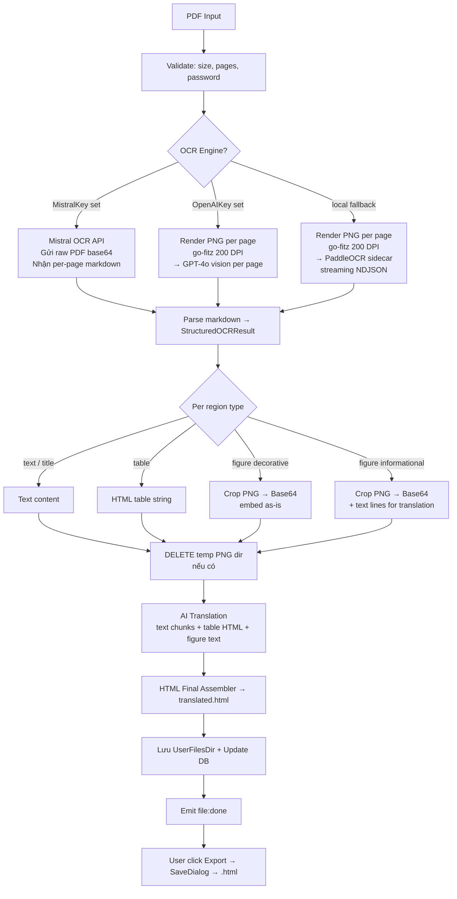

# Technical Architecture: Structured PDF Translation

> Cập nhật lần cuối: 2025-04. Phản ánh trạng thái code thực tế.

---

## 1. Thiết kế Hệ thống (System Overview)

Pipeline **thay thế hoàn toàn** pipeline PDF cũ (Tesseract + pdftotext). Mọi file PDF đều đi qua một luồng duy nhất: `runStructuredPDFTranslate`.

**Tại sao không có routing "digital" vs "scan"?**

`pdftotext` chỉ extract raw text — tables bị flatten, images bị bỏ qua. Một PDF digital có bảng hay stamp vẫn mất structure. Giải pháp đúng: **luôn dùng structured pipeline** — OCR toàn bộ (Mistral hoặc GPT-4o hoặc sidecar). Pipeline này hoạt động tốt cho cả digital lẫn scan.

### OCR Engine — 3-tier fallback

```
1. Mistral OCR API  (MistralKey có trong config)  ← primary, tốt nhất
2. GPT-4o vision    (OpenAIKey có trong config)    ← fallback cloud
3. PaddleOCR sidecar binary / Python .venv         ← fallback local
```

**Mistral là OCR engine ưu tiên** — trả về markdown cấu trúc tốt, không cần render PNG, cost thấp hơn GPT-4o.

> **Trạng thái hiện tại (2025-04):** Mistral đã được test qua dev tool (`cmd/ocr-gpt-preview --engine mistral`) và cho kết quả rất tốt. **Chưa wire vào production pipeline** — đang chuẩn bị tích hợp. Production hiện dùng GPT-4o (tier 2).

### Pipeline flow



---

## 2. Các thành phần chính (Key Components)

### 2.1. PDF Renderer — go-fitz (MuPDF)

**Chỉ dùng khi OCR engine là GPT-4o hoặc PaddleOCR sidecar.** Mistral nhận raw PDF trực tiếp — bỏ qua bước này.

- **Thư viện:** `github.com/gen2brain/go-fitz` — Go binding của MuPDF.
- **Tại sao go-fitz:** MuPDF là PDF renderer chất lượng cao, không cần external binary, cross-platform. CGo dependency — chấp nhận được.
- **Output:** Mỗi trang → `page-{n:04d}.png` trong temp directory.
- **DPI:** 200 DPI.
- **Lifecycle:** Temp dir tồn tại đến sau khi tất cả figure crops đã extract thành Base64. Xóa ngay (`os.RemoveAll`) trước translation phase.

### 2.2. OCR Engines

#### Tier 1 — Mistral OCR API (`ocr_mistral.go` — planned)

- **Endpoint:** `https://api.mistral.ai/v1/ocr`, model `mistral-ocr-latest`.
- **Input:** Raw PDF as base64 `data:application/pdf;base64,...` — **không cần render PNG**.
- **Output:** Per-page markdown → parse thành `StructuredOCRResult`.
- **Markdown → regions:** heading (`#`, `##`) → `title`, markdown table → `table` (convert sang HTML), text block → `text`, image reference → `figure` decorative.
- **Ưu điểm:** Không cần PNG render, xử lý nhanh hơn, tiếng Việt cực tốt (OCR accuracy cao hơn GPT-4o trên legal docs), cost thấp hơn.

#### Tier 2 — GPT-4o Vision (`ocr_gpt_vision.go`)

- **Input:** Per-page PNG (từ go-fitz), resize về max 1600px để tránh lỗi 400.
- **Output:** JSON `{"regions": [...]}` hoặc bare `[...]` — parse thành `StructuredOCRResult`.
- **Mỗi page là 1 API call riêng**, sequential để tránh rate limit vision endpoint.
- **Prompt:** Thiết kế cho legal docs Việt Nam — table/form distinction, merged cells colspan/rowspan, inline formatting (`<strong>`, `<em>`, `<u>`).
- **Model:** `gpt-4o` (không phải `gpt-4o-mini` — đã test, mini không đủ tốt cho complex legal tables).

#### Tier 3 — PaddleOCR Sidecar (`ocr_runner.go`)

- **Binary:** `paddleocr-darwin-arm64` / `paddleocr-windows-amd64.exe` — PyInstaller one-file.
- **Protocol:** Nhận list of PNG paths làm arguments. Output: **streaming NDJSON** — một JSON object per page, kết thúc bằng `{"done": true}` hoặc `{"error": "..."}`.
- **Buffer:** 16MB per line (large tables sinh HTML lớn).
- **Dev fallback:** Nếu không có binary → tìm `.venv/bin/python3` + `ocr_sidecar.py` cùng thư mục.
- **Error handling:** Strip ANSI codes, filter INFO/WARNING log lines trước khi báo lỗi.

### 2.3. StructuredOCRResult — Schema chung

Tất cả 3 OCR engines đều trả về cùng struct:

```go
type StructuredOCRResult struct {
    Pages []OCRPage
}
type OCRPage struct {
    PageNo  int
    Width   int
    Height  int
    Regions []OCRRegion
}
type OCRRegion struct {
    Type       string   // "text" | "title" | "table" | "figure"
    FigureType string   // "decorative" | "informational" (khi type=figure)
    BBox       []int    // [x1, y1, x2, y2] pixels trên PNG 200 DPI
    Content    string   // text/title regions
    Alignment  string   // "left" | "center" | "right"
    HTML       string   // table regions
    TextLines  []string // figure informational regions
}
```

### 2.4. Go: Figure Crops & HTML Assembly (`image_proc.go`, `pdf_html_builder.go`)

**Figure crops** (chỉ áp dụng khi có PNG files — GPT-4o và sidecar paths):
- `extractFigureCrops()`: crop từng figure region theo BBox → Base64 PNG.
- Xóa temp PNG dir **trước** bước translation.

**HTML Assembly** (`assembleStructuredHTML`):
- Duyệt theo thứ tự `page → region`.
- `text` region: `renderTextBlocks()` — double-newline → `<p>` mới, single-newline → space (không dùng `<br>` để tránh artificial right margin). Preserve inline HTML tags (`<strong>`, `<em>`, `<u>`) từ GPT/Mistral as-is.
- `title` region: `<h2>` với optional `style="text-align:center/right"`.
- `table` region: HTML table string trực tiếp từ OCR.
- `figure decorative`: `<figure></figure>`.
- `figure informational`: `<figure><figcaption>[Nội dung đã dịch]</figcaption></figure>`.

### 2.5. AI Translation (`pipeline_pdf_structured.go`)

**3 loại segment:**

1. **Text/title segment** — plain text (có thể chứa inline HTML tags từ GPT/Mistral). `isHTML=true` nếu có `<strong>`/`<em>`/`<u>` → `preserveMarkdown=true` để AI không strip tags.
2. **Table segment** — HTML table string nguyên vẹn. `isHTML=true` → batch riêng, không mix với plain text.
3. **Figure informational** — text lines join bằng ` | `, dịch như plain text.

**Batching:**
- HTML segments (tables) luôn ở batch riêng.
- Plain text segments gom đến max `2500 rune/batch`.
- Concurrent: `MaxBatchConcurrency` goroutines (OpenAI = 4).

**Progress split:**
- OCR phase: 0–50%.
- Translation phase: 50–100%.

**AI refusal detection:** Nếu AI trả về refusal string (PII/privacy filter) → fallback về source text gốc thay vì nhúng refusal vào HTML output.

### 2.6. Export

- `ExportFile` đọc `output_format` từ DB.
- `output_format = "html"` → `SaveDialog` filter `*.html`, default `{tên_gốc}_translated_{rand}.html`.

---

## 3. Database

**Migration 008** (`008_pdf_structured_support.sql`): thêm `output_format TEXT NOT NULL DEFAULT 'docx'` vào bảng `files`.

File PDF qua pipeline mới → `output_format = 'html'`.

---

## 4. Dev Tools

### `cmd/ocr-gpt-preview/`

CLI để inspect OCR output trước khi tích hợp vào production:

```bash
# GPT-4o engine
go run ./cmd/ocr-gpt-preview <pdf_file> [output.html] [--pages 1,2,3]

# Mistral engine
go run ./cmd/ocr-gpt-preview <pdf_file> [output.html] --engine mistral
```

- Output: HTML preview hiển thị từng page với từng region (TITLE / TEXT / TABLE / FIGURE).
- Mistral raw markdown được log ra stderr để debug.

### `ocr_preview.py`

Python script tương tự, dùng PaddleOCR sidecar + OpenCV table augmentation:

```bash
python3 ocr_preview.py <pdf_file> [output.html]
```

---

## 5. Packaging Strategy

**macOS:**
- `brew install mupdf` (một lần).
- `wails build` tự CGo link libmupdf.
- Sidecar binary: `bin/paddleocr-darwin-arm64` (build bằng `make sidecar-mac`).

**Windows AMD64 (build trên Windows ARM64 VM):**
```
pacman -S mingw-w64-x86_64-mupdf mingw-w64-x86_64-gcc
GOARCH=amd64 CGO_ENABLED=1 CC=x86_64-w64-mingw32-gcc wails build
```
- Sidecar binary: `bin/paddleocr-windows-amd64.exe`.

**Keys (dev only):** `backend/config/keys.go` — **không commit lên git** (gitignored).

---

## 6. Điều không thay đổi

- DOCX pipeline (`runDocxTranslate`) — không bị đụng.
- XLSX pipeline (`runXlsxTranslate`) — không bị đụng.
- Chat translation — không bị đụng.
- Wails events schema (`file:progress`, `file:source`, `file:done`, v.v.) — giữ nguyên.
- `ExportFile` — extend thêm HTML support, không thay logic DOCX cũ.

---

## 7. TODO — Tích hợp Mistral vào Production

Việc còn lại để đưa Mistral vào production pipeline:

1. **Tạo `internal/controller/file/ocr_mistral.go`** — port logic từ `cmd/ocr-gpt-preview/mistral_ocr.go`, trả về `*StructuredOCRResult`. Key difference: Mistral không cần PNG render, nhận raw PDF bytes.

2. **Sửa `ocr_runner.go`** — thêm Mistral là tier đầu tiên trong `runStructuredOCR`:
   ```
   MistralKey != "" → runMistralOCR() (skip PNG render)
   OpenAIKey != ""  → runGPTVisionOCR()
   → sidecar binary → Python .venv
   ```

3. **Sửa `pipeline_pdf_structured.go`** — bước render PNG (`renderPDFToImages`) chỉ chạy khi **không dùng Mistral**. Mistral path skip thẳng sang bước OCR.

4. **Figure crops với Mistral:** Mistral không có PNG → figure decorative/informational sẽ không có ảnh embed. Cần quyết định: (a) skip figure crops khi dùng Mistral, hoặc (b) render PNG riêng chỉ cho các trang có figure regions.
