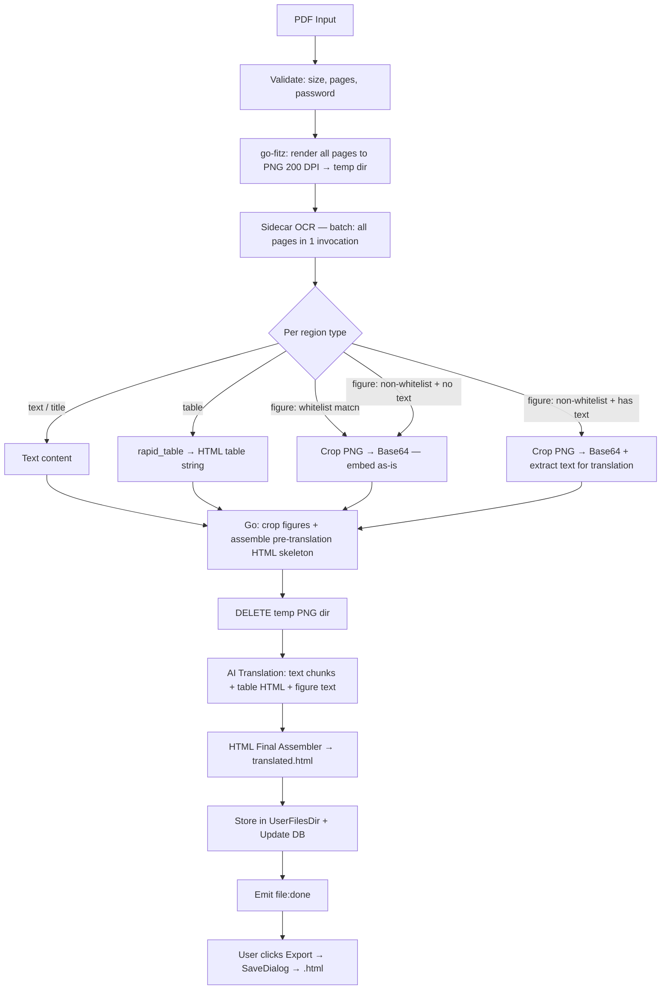

# Technical Architecture: Structured PDF Translation

## 1. Thiết kế Hệ thống (System Overview)

Pipeline mới **thay thế hoàn toàn** pipeline PDF cũ (Tesseract). Mọi file PDF đều đi qua một luồng duy nhất — không có routing, không có lựa chọn.

**Tại sao không có routing "digital simple" vs "scan/complex"?**

`pdftotext` chỉ extract raw text — tables bị flatten thành text lộn xộn, toàn bộ images bị bỏ qua. Một PDF digital có bảng biểu hay logo vẫn mất structure nếu dùng plain pipeline. Không thể đảm bảo output quality đồng đều nếu có hai nhánh xử lý khác nhau. Giải pháp đúng: luôn dùng structured pipeline — render PDF → PNG → RapidOCR. Pipeline này hoạt động tốt cho cả digital lẫn scan, chỉ khác là digital PDF cho OCR accuracy cao hơn.



---

## 2. Các thành phần chính (Key Components)

### 2.1. PDF Renderer — go-fitz (MuPDF)

*   **Thư viện:** `github.com/gen2brain/go-fitz` — Go binding của MuPDF.
*   **Tại sao go-fitz thay vì pdftopng/pdftoppm:**
    *   MuPDF là một trong những PDF renderer chất lượng cao nhất hiện có (cùng chuẩn spec compliance với Adobe). Poppler và XPDF kém hơn về một số edge cases (complex vector graphics, certain font types, transparency layers).
    *   Không cần external binary — loại bỏ hoàn toàn complexity của pdftopng/pdftoppm và fallback logic.
    *   Cross-platform không cần packaging thêm binary.
    *   Downside: CGo dependency, build phức tạp hơn một chút — chấp nhận được vì đây là tradeoff có chủ đích.
*   **Output:** Mỗi trang PDF → PNG file trong temp directory, tên file = `page-{n:04d}.png`.
*   **DPI:** 200 DPI — đủ cho OCR accuracy, không quá lớn về memory.
*   **Mục đích của PNG files (2 use cases):**
    1.  Input cho sidecar OCR.
    2.  Source để crop figure regions theo bbox.
*   **Lifecycle:** PNG temp dir tồn tại từ bước render đến sau khi tất cả figure crops đã được extract thành Base64. Sau đó **xóa ngay** (`os.RemoveAll`) trước khi bắt đầu translation phase. Không để temp files tồn tại suốt pipeline.

### 2.2. Sidecar OCR Engine (batch mode)

*   **Thư viện:** `rapidocr_onnxruntime` + `rapid_layout` + `rapid_table` + `cv2` (ONNX Runtime, CPU).
*   **Invocation:** Nhận toàn bộ danh sách image paths trong **một lần gọi** — model load một lần, process tất cả pages, không reload per page.
*   **Pipeline per page:**
    1.  `rapid_layout` → detect layout regions: `text`, `title`, `table`, `figure`.
    2.  `text` / `title` → `rapidocr` → extract text content.
    3.  `table` → `rapid_table` → dựng HTML table string.
    4.  `figure` → chạy **Figure Classifier** (xem bên dưới).

#### Figure Classifier — Whitelist approach

Mỗi figure region được classify theo logic:

```
figure region
    │
    ├─ [Whitelist match?] ─── YES ──→ figure_type = "decorative"
    │   (logo / seal / signature)         → chỉ trả bbox, không extract text
    │
    └─ NO
        │
        ├─ [Run RapidOCR trên vùng crop]
        │
        ├─ [Text detected?] ── YES ──→ figure_type = "informational"
        │                                  → trả bbox + danh sách text lines
        │
        └─ NO ──────────────────────→ figure_type = "decorative"
                                          → chỉ trả bbox, không có text
```

**Whitelist detection heuristics** (dùng `cv2` đã bundled):

| Loại | Heuristic |
|---|---|
| **Seal / Stamp** | Circularity ratio `4π × area / perimeter²` > 0.7 AND bbox aspect ratio gần 1:1. Thường có màu đỏ/tím dominant (check HSV color histogram). |
| **Signature** | Bbox nằm ở phần dưới trang (y_min > 65% page height) AND text rất ít (< 5 words nếu có) AND width/height ratio > 3 (ngang). |
| **Logo** | Bbox nằm trong top 20% trang AND diện tích bbox < 8% diện tích trang AND xuất hiện ở trang đầu tiên hoặc header area. |

Whitelist là **extensible**: thêm heuristic mới không làm ảnh hưởng logic xử lý phần còn lại.

**Informational figure output** (chart, biểu đồ, diagram, v.v.):
*   Go nhận danh sách text lines từ sidecar.
*   Crop ảnh gốc → embed Base64.
*   HTML output: ảnh gốc + block annotation bên dưới chứa text đã dịch.
*   Ảnh gốc **không bị modify** — user thấy visual gốc + translation riêng bên dưới.

### 2.3. Go HTML Assembler

*   Parse JSON từ sidecar → build pre-translation HTML skeleton.
*   **Decorative figures** (`figure_type = "decorative"`): crop PNG theo bbox → Base64 → ``.
*   **Informational figures** (`figure_type = "informational"`): crop PNG → Base64 → `` + placeholder `<div class="figure-translated-text" data-translate="true">` chứa raw text lines (sẽ được điền sau khi dịch).
*   **Sau khi tất cả figure crops xong → xóa temp PNG dir.**
*   Đánh dấu các elements cần dịch bằng `data-translate` attribute để translation phase biết phần nào cần gửi lên AI.

### 2.4. AI Translation

*   **Input — 3 loại segment:**
    1.  **Text segment** (`text`/`title` regions): plain text, gom thành chunks 5000 chars, dịch bằng `TranslateStream`.
    2.  **Table segment**: HTML table string nguyên vẹn, 1 request per table. Prompt: *"Translate only the text inside `<td>` and `<th>` tags. Do NOT modify HTML structure."*
    3.  **Informational figure text**: danh sách text lines từ figure region, dịch như plain text. Output được điền vào annotation block bên dưới ảnh gốc.
*   **Figure decorative regions không bao giờ được gửi lên AI.**
*   **Concurrency:** Text chunks và figure text → `MaxBatchConcurrency` (4 với OpenAI). Tables → sequential.

### 2.5. HTML Final Assembler

*   Reassemble HTML theo thứ tự page → region, điền kết quả dịch vào đúng placeholders.
*   **Informational figure HTML structure:**
    ```html
    <div class="figure-block">
      
      <div class="figure-translated-text">
        <span class="label-meta">[Nội dung đã dịch từ hình ảnh]</span>
        <p>...translated text lines...</p>
      </div>
    </div>
    ```
*   **Decorative figure HTML structure:**
    ```html
    <div class="figure-block">
      
    </div>
    ```
*   Lưu `translated.html` vào `UserFilesDir/files/{fileId}/`.

### 2.6. Export

*   `ExportFile` đọc `output_format` từ DB.
*   `output_format = "html"` → `SaveDialog` filter `*.html`, default filename `{tên_gốc}_translated.html`.
*   `output_format = "docx"` → giữ nguyên behavior hiện tại.

---

## 3. Database Migration

*   **008_pdf_structured_support.sql** (đã có): `output_format TEXT NOT NULL DEFAULT 'docx'`.
*   File PDF qua pipeline mới set `output_format = 'html'`.

---

## 4. Giao diện Dữ liệu (Sidecar JSON Contract)

Sidecar nhận: list of PNG image paths làm arguments.
Sidecar trả về qua stdout:

```json
{
  "pages": [
    {
      "page_no": 1,
      "width": 1654,
      "height": 2339,
      "regions": [
        {
          "type": "text",
          "bbox": [100, 80, 900, 120],
          "content": "Tiêu đề tài liệu"
        },
        {
          "type": "title",
          "bbox": [100, 140, 600, 180],
          "content": "Chương 1: Tổng quan"
        },
        {
          "type": "table",
          "bbox": [100, 200, 1500, 900],
          "html": "<table><tr><th>Cột 1</th><th>Cột 2</th></tr><tr><td>A</td><td>B</td></tr></table>"
        },
        {
          "type": "figure",
          "figure_type": "decorative",
          "bbox": [50, 20, 300, 120]
        },
        {
          "type": "figure",
          "figure_type": "informational",
          "bbox": [100, 500, 1500, 1200],
          "text_lines": ["Doanh thu Q1", "2,500 tỷ", "Doanh thu Q2", "3,100 tỷ"]
        }
      ]
    }
  ]
}
```

**Field rules:**
*   `type`: `text`, `title`, `table`, `figure`.
*   `bbox`: `[x_min, y_min, x_max, y_max]` — pixel coordinates trên PNG 200 DPI.
*   `content`: chỉ có khi `type = text` hoặc `title`.
*   `html`: chỉ có khi `type = table`.
*   `figure_type`: `"decorative"` hoặc `"informational"` — chỉ có khi `type = figure`.
*   `text_lines`: list of strings — chỉ có khi `type = figure` AND `figure_type = "informational"`.

---

## 5. Phân phối & Triển khai (Packaging Strategy)

Mỗi platform được build **natively trên chính platform đó** — không cross-compile. Đây là cách chuẩn cho CGo dependencies.

**macOS (build trên Mac):**
*   Cài một lần: `brew install mupdf`
*   CGo tự link libmupdf khi `wails build`. Không cần config thêm.

**Windows AMD64 binary (build trên Windows ARM64 VM):**
*   Target là AMD64, VM là ARM64 → cần AMD64 C compiler, không phải ARM64 native compiler.
*   Cài **AMD64 MSYS2** (chạy dưới WOW64 emulation trên ARM64 Windows, hoạt động tốt):
    ```
    pacman -S mingw-w64-x86_64-mupdf mingw-w64-x86_64-gcc
    ```
*   Build với explicit AMD64 toolchain:
    ```
    GOARCH=amd64 CGO_ENABLED=1 CC=x86_64-w64-mingw32-gcc wails build
    ```
*   One-time setup. AMD64 emulation trên Windows ARM64 đủ ổn định cho mục đích build.

**Sidecar binary:**
*   PyInstaller one-file: `paddleocr-darwin-arm64` (build trên Mac), `paddleocr-windows-amd64.exe` (build trên Windows).
*   Đặt trong `bin/`, Wails tự copy vào bundle khi build production.
*   Makefile targets: `make sidecar-mac`, `make sidecar-win`.

**Cleanup sau migration:**
*   `bin/pdftopng-mac`, `bin/pdftotext-mac`, `bin/tesseract`, `bin/tessdata/` — có thể xóa sau khi pipeline mới đã verify ổn định.

---

## 6. Điều không thay đổi

*   DOCX pipeline (`runDocxTranslate`) — không bị đụng.
*   Chat translation — không bị đụng.
*   Wails events schema (`file:progress`, `file:done`, v.v.) — giữ nguyên.
*   `ExportFile` được extend thêm HTML support, không replace logic DOCX cũ.
