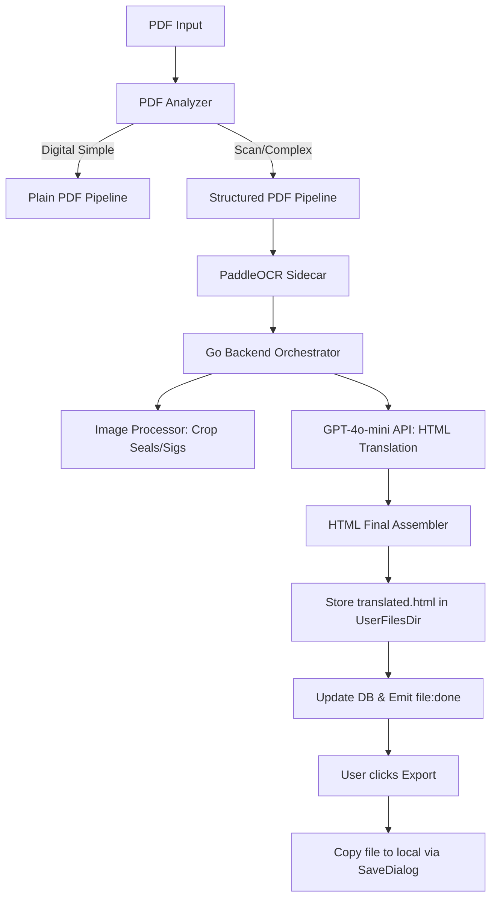

# Technical Architecture: Structured PDF Translation

## 1. Thiết kế Hệ thống (System Overview)
Pipeline dịch PDF chuyên sâu được tích hợp song song với các pipeline hiện tại (DOCX, PDF Plain).



## 2. Các thành phần chính (Key Components)

### 2.1. Sidecar OCR Engine
*   **PaddleOCR (ONNX Runtime):** Tối ưu cho CPU. 
*   **Chế độ Multi-OS:** 
    *   Tự động phát hiện OS (Darwin/Windows) để gọi đúng binary thực thi.
    *   Binary được đặt trong `bin/` và được đóng gói cùng ứng dụng.

### 2.2. Backend Orchestration (Safe Updates)
*   **Pipeline mới:** `runStructuredPDFTranslate` sẽ xử lý các file PDF được nhận diện là có cấu trúc phức tạp/scan.
*   **Image Handling:** Sử dụng thư viện `disintegration/imaging` cho tác vụ cắt ảnh (Crop) dấu và chữ ký.
*   **No Regression:** Các luồng `runDocxTranslate` và `runPDFTranslate` (Digital Plain) không bị thay đổi logic bên trong.

### 2.3. AI Gateway (GPT-4o-mini)
*   Sử dụng **Structured HTML Prompting**: Yêu cầu AI dịch mã HTML mà không làm hỏng các thẻ tag.
*   **Contextualization:** Gửi khối nội dung bảng để AI hiểu và dịch chính xác từng ô.

### 2.4. Trải nghiệm người dùng (UX Integration)
*   **Import:** Tương thích hoàn toàn với luồng `TranslateFile` hiện tại.
*   **Export:** Hàm `ExportFile` được cập nhật để cho phép người dùng lưu dưới dạng `.html`.

## 3. Database Migration
*   **008_...sql:** Thêm cột `output_format` cho bảng `files` để phân biệt file dịch xong là `.docx` hay `.html`. Việc này không làm hỏng dữ liệu cũ (mặc định sẽ là `docx`).

## 4. Kiểm soát Dung lượng & Hiệu năng
*   Đóng gói model AI PaddleOCR tối ưu (ước tính 400-600MB).
*   Chạy OCR tuần tự theo từng trang để tiết kiệm RAM.

## 5. Giao diện Dữ liệu (Sidecar JSON Contract)
Sidecar PaddleOCR sẽ trả về một cấu trúc JSON qua stdout để Go Backend xử lý:

```json
{
  "pages": [
    {
      "page_no": 1,
      "width": 1240,
      "height": 1754,
      "regions": [
        {
          "type": "text",
          "bbox": [100, 100, 500, 150],
          "content": "Tiêu đề tài liệu"
        },
        {
          "type": "table",
          "bbox": [100, 200, 1100, 800],
          "html": "<table>...</table>"
        },
        {
          "type": "seal",
          "bbox": [800, 1400, 1000, 1600]
        },
        {
          "type": "signature",
          "bbox": [900, 1500, 1100, 1650]
        }
      ]
    }
  ]
}
```
*   `type`: `text`, `table`, `seal`, `signature`.
*   `bbox`: [x_min, y_min, x_max, y_max].
*   `html`: Mã HTML thô của bảng biểu do OCR dựng.

## 6. Phân phối & Triển khai (Packaging Strategy)
*   **macOS:** Đóng gói thư viện động `.dylib` và binary PaddleOCR.
*   **Windows:** Đóng gói thư viện động `.dll` và binary PaddleOCR.exe.
*   Wails tự động copy nội dung thư mục `bin/` vào trong Bundle khi build production.
